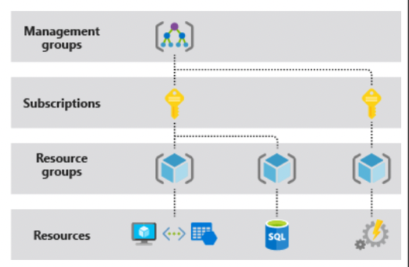
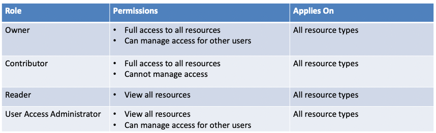
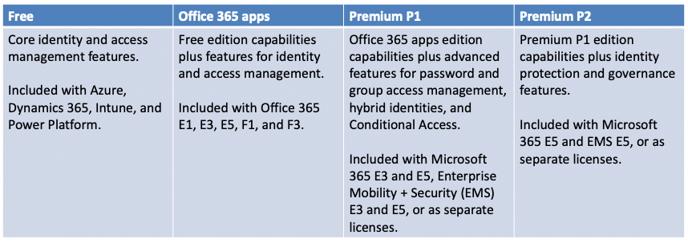

# Starting point !

The following steps should guide you through Azure:

1. Understanding what Azure and Azure AD are, how Microsoft envisions it and the basic concepts around them: [Azure and Azure AD](/cloud/azure#azure-101)
2. Learning the different official ways of [interacting with Azure](/cloud/azure#interacting-with-azure):
   - [Azure portal](/cloud/azure#portal): The basic one through a gragical interface on Microsoft's site. It uses the REST apis of several other microsoft services such as management.azure.com, graph.microsoft.com, sts.windows.net or graph.windows.net. The portal has some client-side restrictions so it should be used with a grain of salt
   - [Azure-cli](/cloud/azure#azure-cli): Command line tool to interact with Azure and Azure AD, it is multiplatform and can be used in any OS.
   - [Powershell Modules](/cloud/azure#powershell-modules): A subset of modules for powershell for accessing Azure / Azure AD. Most of them are multiplatform and can be used with powershell and .Net core, but do not expect perfect results.
   - [RESTFul APIs](/cloud/azure#restful-apis)

# Azure 101

The most important part of Azure is **Azure Active Directory (Azure AD or AAD)** which is the identity and access management service of azure. All microsoft users can be managed from azure ad, from personal to organizational. AAD can be used to access both external resources like azure portal, office 365, outlook... and also internal resources in on-premise applications.

In Azure AD there are several important concepts that should be noted:

- **Tenant** - An instance of Azure AD that represents a single organization
- **Azure AD Directory** - Each tenant has a dedicated Directory used to perform IAM functions for resources
- **Subscriptions** - It is used to pay for services. There can be many subscrptions in a directory
- **Core Domain** - The initial domain is *tenant*.onmicrosoft.com but it is posible to define custom domains too.

In Azure, a security principal defines the access policy and permissions for the user/application in the Azure AD tenant. This enables core features such as authentication of the user/application during sign-in, and authorization during resource access.

**What is a resource? Everything is a resource!**

  

1. Management groups - There is always at least one group named root
    - Groups can manage multiple subscriptions
    - All subscriptions in a management group belong to the same tenant and inherit the permissions
    - A management group can contain another group but root is the main one.
    - A global administration can always elevate their privileges to the Root management group
2. Subscriptions
    - Is a logical unit of Azure services that links to an Azure account
    - Is a billing and/or access control boundary in AAD
    - An AAD can have multiple subscriptions but each subscription can only trust a single directory
    - An azure role aplied at the subscription level applies to all the resources within the subscription
3. Resource Groups and Resource
    - A resource is a deployaable item in Azure like VMs, App Service, Storage Accounts...
    - A resource group acts as a container for resources
    - In Azure, all the resources must be inside a resource group and can belong only to a group
    - If a resource group is deleted then its resources are also deleted
    - A resource group has its own IAM settings for providing role based access. An Azure role applied to the resource group is applied by default to all the resources in the group

**Azure provides the ability to assign Security Principals to resources** like app services, function apps, virtual machines... The resources can then use Azure AD tokens to access other resources such as key vaults, storage accounts...

Put simply, the difference between a managed identity and a service principal is that a managed identity manages the creation and automatic renewal of a service principal on your behalf.

**Azure AD is not Azure.** Azure is Microsoft's cloud platform whereas Azure AD is enterprise identity service in Azure

In Azure there are more than 120 built-in roles and we can define custom roles too. The four fundamental are:

  

**An Azure AD Object/Principal has a role on a defined scope**. Also an explicit deny role assignment takes precedence

There exists Azure Attribute Based Access Control that provides fine-grained access control based on attributes of a resource, security principal or environment. For example a ABAC rule can restrict an user to access only the blob storages tagged as some attribute.

Global Administrator is kinda the Azure equivalent to a Domain Admin as it has the ability to 'elevate' to User Access Administrator Azure role to the root management group.

There are different tiers of Azure depending on what you want to pay

  

# Interacting with Azure

There are different ways to interact with Azure. The most popular ones are:

- Some microsoft portals
- az-cli - To manage Azure resources
- az-powershell modules - To manage Azure resources
- Azure AD PowerShell module - To manage Azure AD
- Other tools that use the rest apis

## Portal

Access the main portal here: [http://portal.azure.com/](http://portal.azure.com)\
To start the tests you should have access with a user with **Reader permissions over the subscription** and **Global Reader role in AzureAD**. If even in that case you are **not able to access the content of the Storage accounts** you can fix it with the **role Storage Account Contributor**.

Remember that if the **Security Centre Standard Pricing Tier** is being used and **not** the **free** tier, you can **generate** a **CIS compliance scan report** from the azure portal. Go to _Policy & Compliance -> Regulatory Compliance_ (or try to access [https://portal.azure.com/#blade/Microsoft\_Azure\_Security/SecurityMenuBlade/22](https://portal.azure.com/#blade/Microsoft\_Azure\_Security/SecurityMenuBlade/22)).

> If the company is not paying for a Standard account you may need to review the **CIS Microsoft Azure Foundations Benchmark** by "hand" (you can get some help using the following tools). Download it from [**here**](https://www.newnettechnologies.com/cis-benchmark.html?keyword=\&gclid=Cj0KCQjwyPbzBRDsARIsAFh15JYSireQtX57C6XF8cfZU3JVjswtaLFJndC3Hv45YraKpLVDgLqEY6IaAhsZEALw\_wcB#microsoft-azure).

There are also several other portals that can be used to administrate different Azure modules, you can find a comprensible list in the link bellow:

[https://msportals.io](https://msportals.io)

## Azure-cli

It is recommended to **install azure-cli** in a **linux** and **windows** virtual machines (to be able to run powershell and python scripts): [https://docs.microsoft.com/en-us/cli/azure/install-azure-cli?view=azure-cli-latest](https://docs.microsoft.com/en-us/cli/azure/install-azure-cli?view=azure-cli-latest)\

Then, run `az login` to login, it will open the default web browser to provide the credentials

> Note the **account information** and **token** will be **saved** inside _\<HOME>/.azure_ (in both Windows and Linux).

If you want to login from the terminal you can use the following commands:


<smart-tabs variable="tenant_or_not" :tabs="{'default_tenant': 'As user with default tenant', 'specific_tenant': 'As service principal'}">
<template v-slot:default_tenant>

Simple login with the default tenant

```powershell
az login -u '{{ user user@domain.com }}' -p '{{ password Password }}'
```

</template>
<template v-slot:specific_tenant>

Login specifying tenant

```powershell
az login --service-principal -u '{{ user user@domain.com }}' -p '{{ password Password }}' {{ tenantId tenantId }}
```

</template>
</smart-tabs>

To list the accounts

```powershell
az account list
```

List the subscriptions for all the accounts and save it in separate files

```bash
for row in $(az account list --all | jq -r '.[].id'); do
	echo "az functionapp list --subscription '$row' | jq '.[] | [{name, id, kind}]'"
	az functionapp list --subscription "$row" | tee ${row##*/}.subs.json
done
```

Get access token for app or resource ([Documentation](https://docs.microsoft.com/en-us/cli/azure/account?view=azure-cli-latest#az-account-get-access-token))

```bash
az account get-access-token --resource-type ms-graph
```

Logout:

```bash
az logout
```

Documentation: [https://docs.microsoft.com/en-us/cli/azure/](https://docs.microsoft.com/en-us/cli/azure/)

## Powershell modules

There is a variety of Powershell modules to interact with Azure

### Az ([PowerShell Gallery](https://www.powershellgallery.com/packages/Az/7.4.0))

Microsoft Azure PowerShell - Cmdlets to manage resources in Azure. This module is compatible with PowerShell and Windows PowerShell. 

Installation:

```powershell
Install-Module -Name Az -Scope CurrentUser -Repository PSGallery -Force
```

Documentation: [https://docs.microsoft.com/en-us/powershell/azure/?view=azps-7.4.0](https://docs.microsoft.com/en-us/powershell/azure/?view=azps-7.4.0)

### AzureAD ([PowerShell Gallery](https://www.powershellgallery.com/packages/AzureAD/2.0.2.140))

This is the  Azure Active Directory PowerShell for Graph. This module requires Windows >= 7 except in the preview branch:

Installation:

```powershell
Install-Module -Name AzureAD -Scope CurrentUser -Repository PSGallery -Force
# You can install the Preview if you want
# Install-Module -Name AzureADPreview -Scope CurrentUser -Repository PSGallery -Force
```

Documentation: [https://docs.microsoft.com/en-us/powershell/module/azuread/?view=azureadps-2.0](https://docs.microsoft.com/en-us/powershell/module/azuread/?view=azureadps-2.0)

### MSOnline ([PowerShell Gallery](https://www.powershellgallery.com/packages/MSOnline/1.1.183.66))

This is the older MSOnline V1 PowerShell module for Azure Active Directory. Customers are encouraged to use the newer Azure Active Directory V2 PowerShell module instead of this module

Installation:

```powershell
Install-Module -Name MSOnline -Scope CurrentUser -Repository PSGallery -Force
```

Documentation: [https://docs.microsoft.com/en-us/powershell/module/msonline/?view=azureadps-1.0](https://docs.microsoft.com/en-us/powershell/module/msonline/?view=azureadps-1.0)

### MicroBurst ([GitHub](https://github.com/NetSPI/MicroBurst))

### AADInternals ([GitHub](https://github.com/Gerenios/AADInternals))

### MSOLSpray ([GitHub](https://github.com/dafthack/MSOLSpray))

### Roadrecon ([GitHub](https://github.com/dirkjanm/ROADtools))

## Restful-apis

hello everyone i am contributing

### graph.microsoft.com
      - [Microsoft Graph](/cloud/azure#microsoft-graph): An API to interact with Azure AD specifically.

### management.microsoft.com

### exchange.microsoft.com

### office.microsoft.com

      - [Exchange API](/cloud/azure#exchange): An API to interact with Azure AD. Deprecated in favour of Microsoft Graph.
      - [Office 365 APIs](/cloud/azure#office-365-apis): A subset of APIs to interact with some Office 365. Deprecated in favour of Microsoft Graph