## Submiting Docker builds to Azure

### Pre-required steps

#### Create a resource group

First you need a resource group to contain all your stuff. If you don't know which regions are available to you, just use the `az account list-locations -o table` command. Then create the group as follows:

```shell
az group create --name {{ resource-group-name $RESOURCE_GROUP_NAME }} --location {{ location ukwest }}
```

#### Create a container registry

```shell
az acr create --resource-group {{ resource-group-name $RESOURCE_GROUP_NAME }} --name {{ acr-name $ACR_NAME }} --sku Standard --location {{ location ukwest }}
```

You can check  your created container registries with `az acr list`:

```shell
az acr list -o {{ output-format table }}
```

### Build in Azure with ACR Tasks

You can submit files to be built on azure. This way you don't require a Docker host [^1]:

[^1]: You can follow Azure's [official tutorial](https://docs.microsoft.com/en-us/azure/container-registry/container-registry-tutorial-quick-task)

```shell
az acr build --registry {{ acr-name $ACR_NAME }} --resource-group {{ resource-group-name $RESOURCE_GROUP_NAME }} --image {{ repository $REPOSITORY_NAME }}:{{ tag latest }} .
```

You can list the uploaded images as follows:

```shell
az acr repository show-tags --name {{ acr-name $ACR_NAME }} --repository {{ repository $REPOSITORY_NAME }} --resource-group {{ resource-group-name $RESOURCE_GROUP_NAME }}
```

## Deploying a container as a Web Application


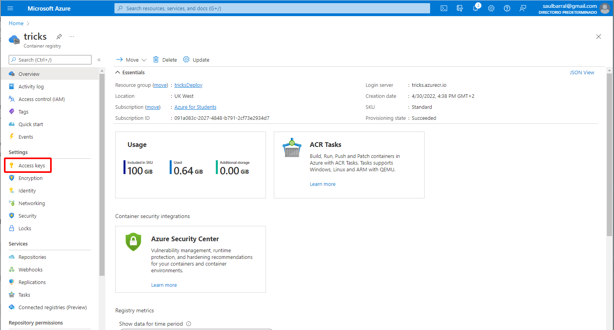

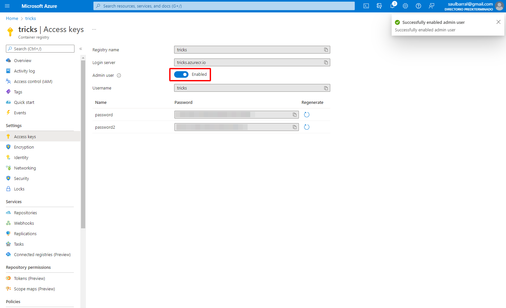

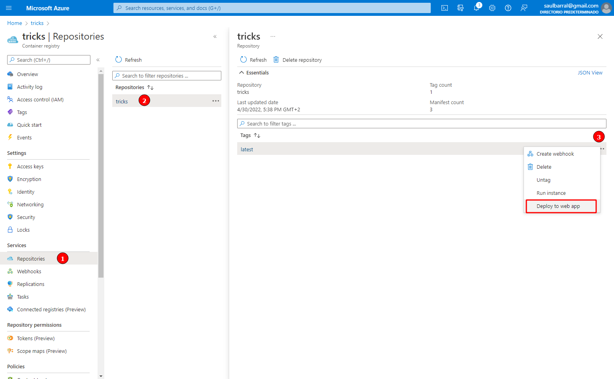

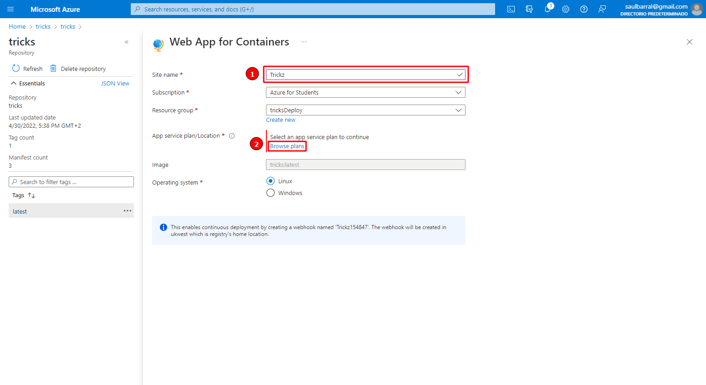

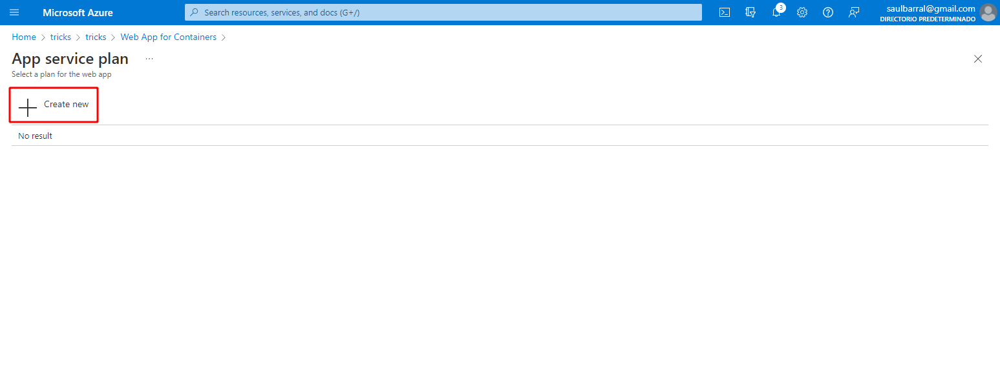

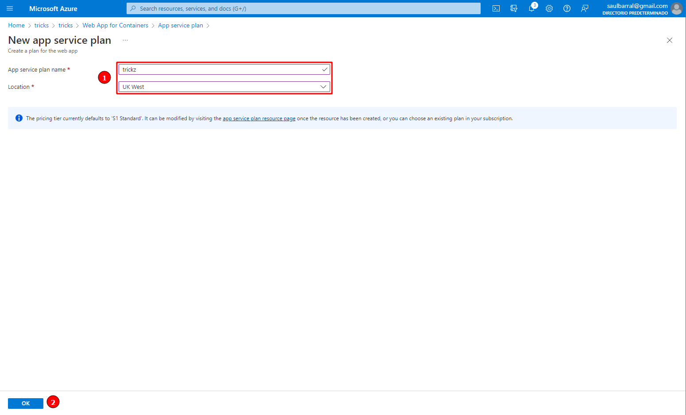

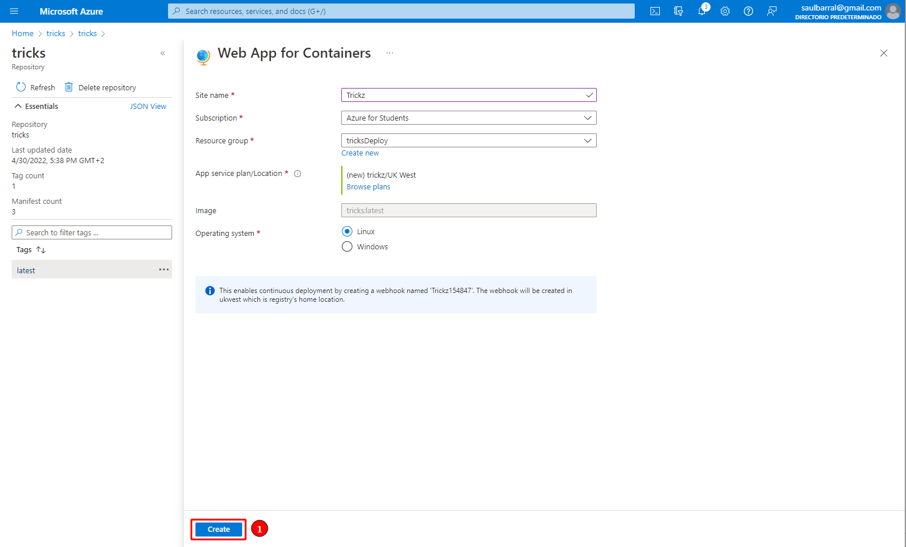

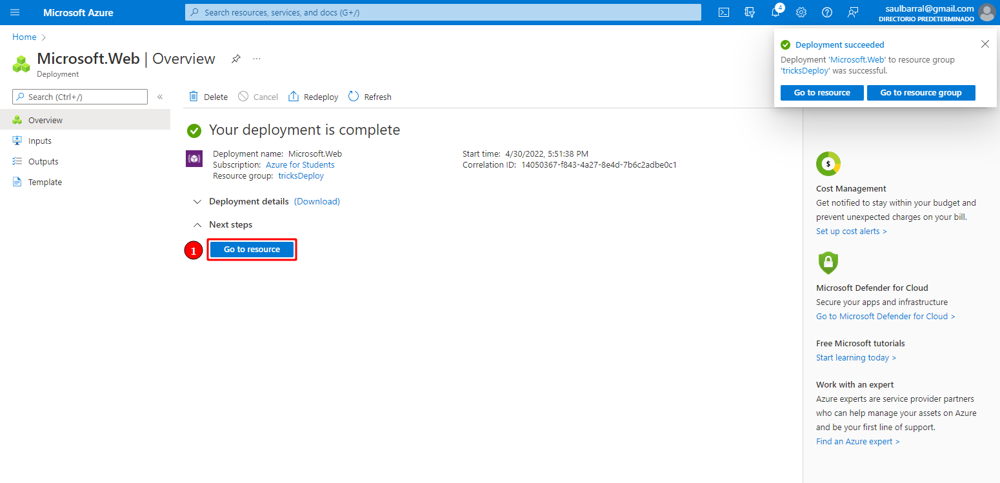

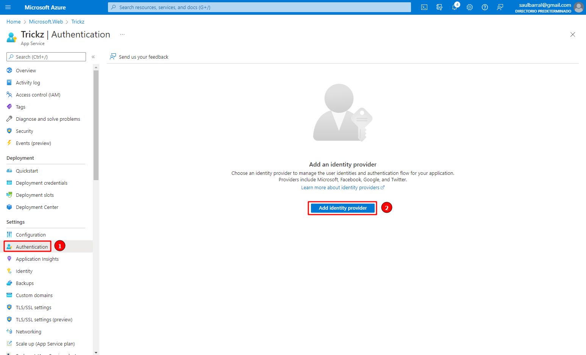


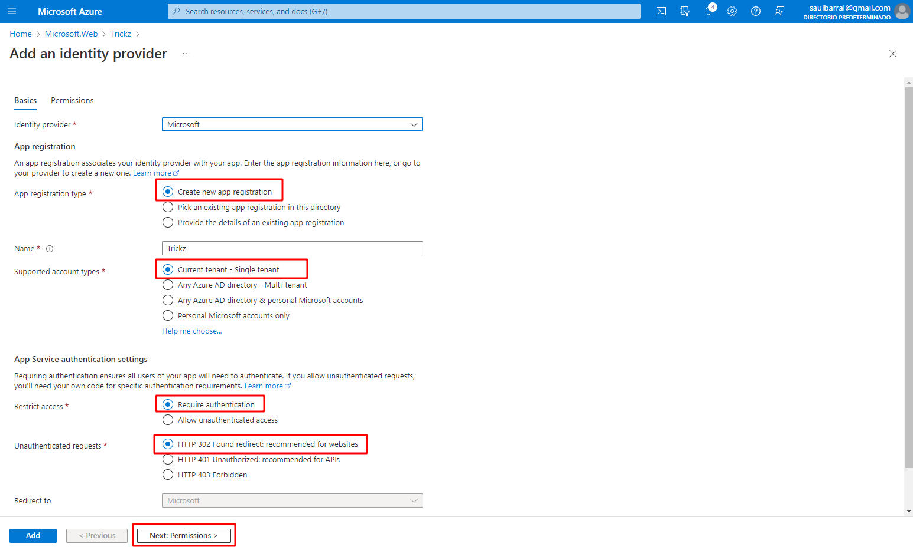

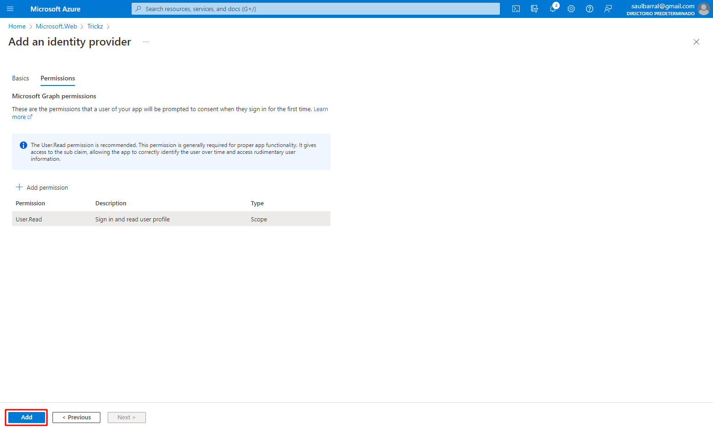

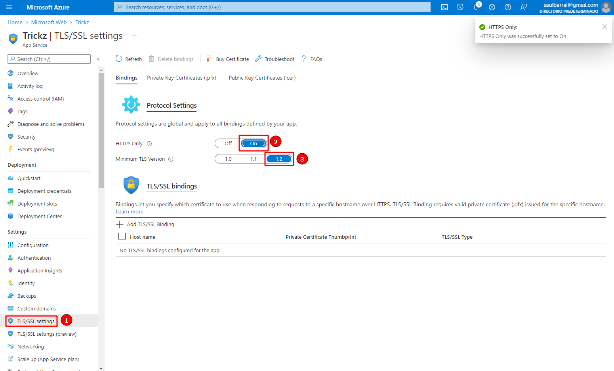

Finally add the `WEBSITES_PORT` setting with a value of `8080`:

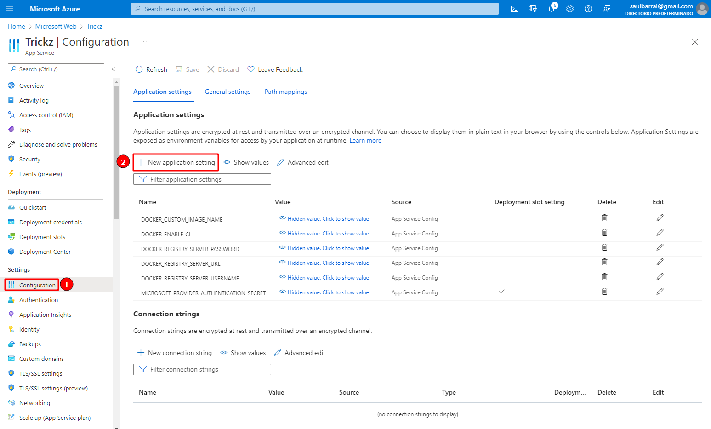

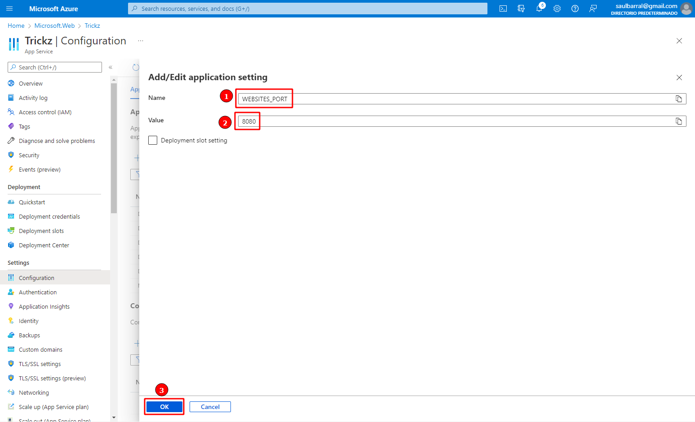

Remember to hit the **Save** button:

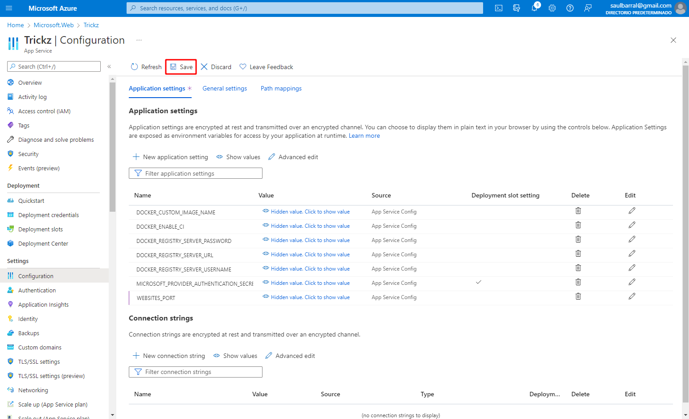

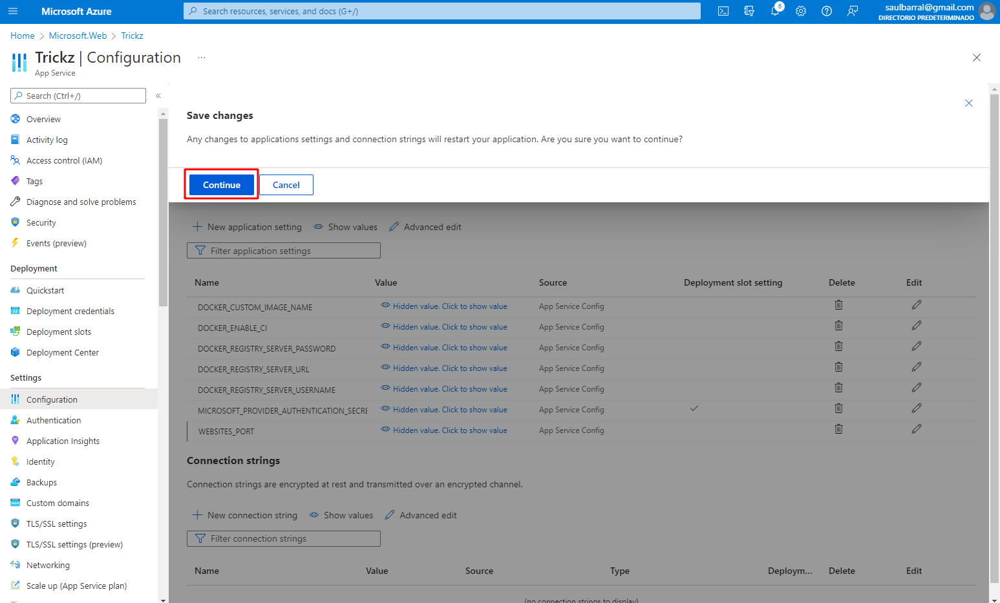

Finally you might want to restart the container to make sure everything was reseted properly and browse the application. Take in mind that It takes a while to start running for the first time:

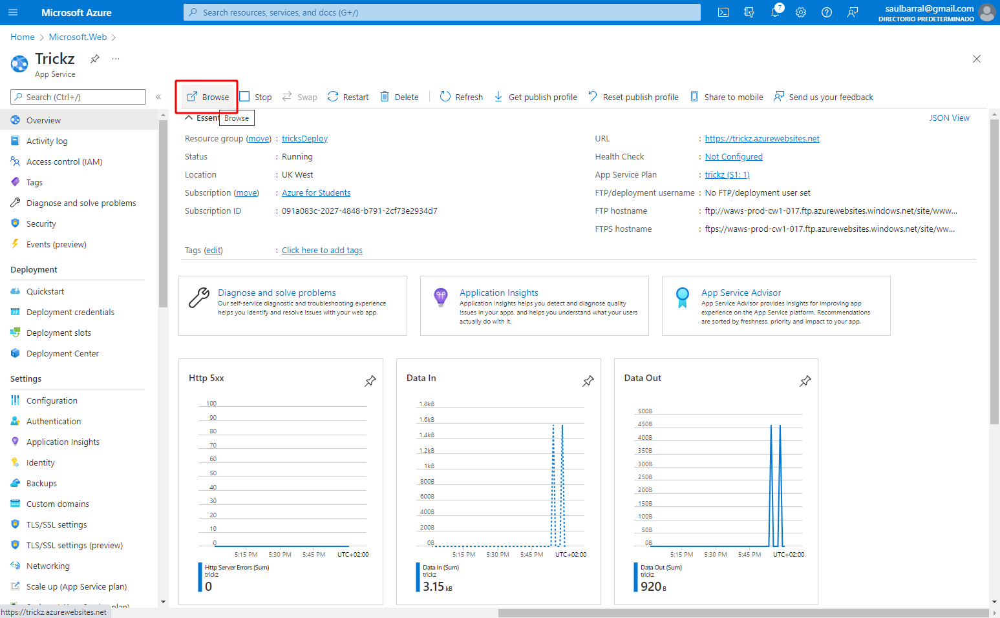


## Redeployment

Now when you want to update the application, the only command to use is the following:


```shell
az acr build --registry {{ acr-name $ACR_NAME }} --resource-group {{ resource-group-name $RESOURCE_GROUP_NAME }} --image {{ repository $REPOSITORY_NAME }}:{{ tag latest }} .
```