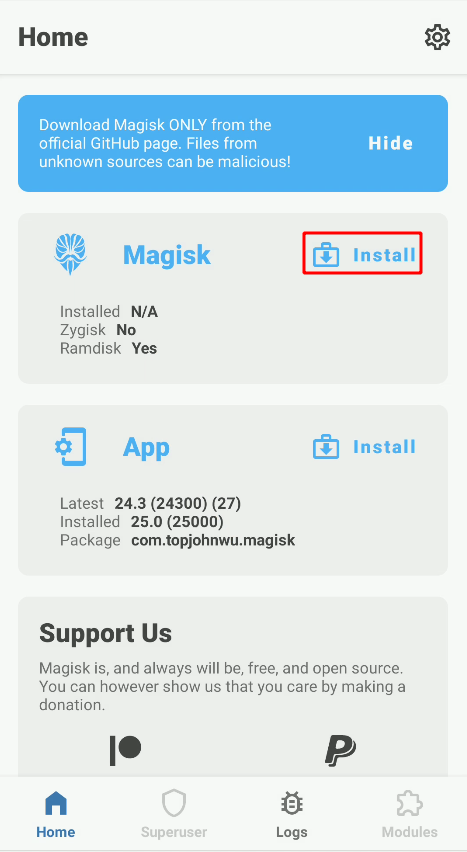
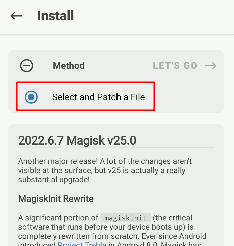
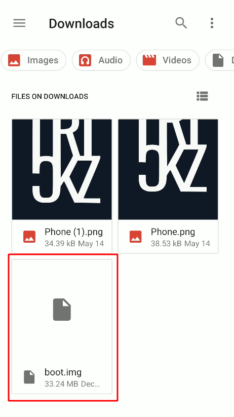
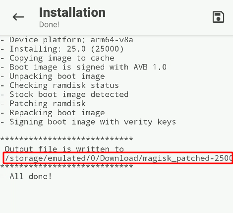

> WIP

## Initial requirements

### Preparing the phone

Firt thing is to enable developer options and allow OEM unlocking (unlocking the bootloader).

> TODO: Take pictures and add some description

### ADB and fastboot

I usually install both tools with chocolatey's [ADB package](https://community.chocolatey.org/packages/adb) (includes `adb` and `fastboot`):

```powershell
choco install adb
```

If you want to use these tools, adding aliases is recommended:

```shell
alias adb="adb.exe"
alias fastboot="fastboot.exe"
```

Test if everything works with:

```shell
adb devices
```

## Magisk

```shell
wget https://github.com/topjohnwu/Magisk/releases/download/v25.0/Magisk-v25.0.apk -O magisk.apk
```

```shell
adb install magisk.apk
```

```shell
adb push boot.img /sdcard/Download/boot.img
```









```shell
adb pull /storage/emulated/0/Download/$(adb shell "ls /storage/emulated/0/Download | grep magisk_patched | tr -d '\r\n'") magisk_patched.img
```

```shell
adb reboot bootloader
```

```shell
fastboot oem unlock
```

```shell
fastboot flash boot magisk_patched.img
```

```shell
fastboot reboot
```

Open Magisk app. Update, enable Zygisk and reboot the phone

https://github.com/LSPosed/LSPosed/releases

```shell
adb shell "curl -L 'https://github.com/LSPosed/LSPosed/releases/download/v1.8.3/LSPosed-v1.8.3-6552-zygisk-release.zip' --output /storage/emulated/0/Download/LSPosed.zip"
```

## Tools

### Frida

Frida agent

[MagiskFrida](https://github.com/ViRb3/magisk-frida/releases/latest)

```shell
adb shell "curl -L 'https://github.com/ViRb3/magisk-frida/releases/download/15.1.24-1/MagiskFrida-15.1.24-1.zip' --output /storage/emulated/0/Download/magisk-frida.zip"
```

```shell
pip install frida-tools objection
```

```shell
find -name "frida*exe" | sed 's/.\/\(.*\).exe/alias \1=\1.exe/' | clip.exe
```

Check

```shell
frida-ps -U
```

https://github.com/Magisk-Modules-Repo/movecert/archive/refs/heads/master.zip

### System CA

https://github.com/NVISOsecurity/MagiskTrustUserCerts/releases/latest

```shell
adb shell "curl -L 'https://github.com/NVISOsecurity/MagiskTrustUserCerts/releases/download/v0.4.1/AlwaysTrustUserCerts.zip' --output /storage/emulated/0/Download/movecert.zip"
```

### Drozer

https://github.com/FSecureLABS/drozer/releases/latest

```shell
curl -L 'https://github.com/FSecureLABS/drozer/releases/download/2.3.4/drozer-agent-2.3.4.apk' --output drozer-agent.apk
adb install drozer-agent.apk
```
