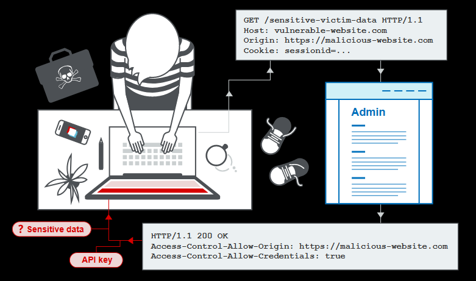
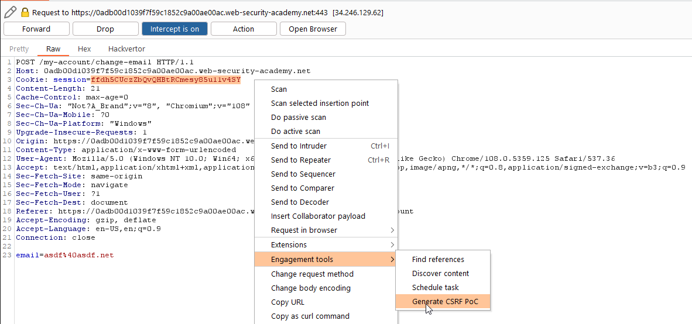
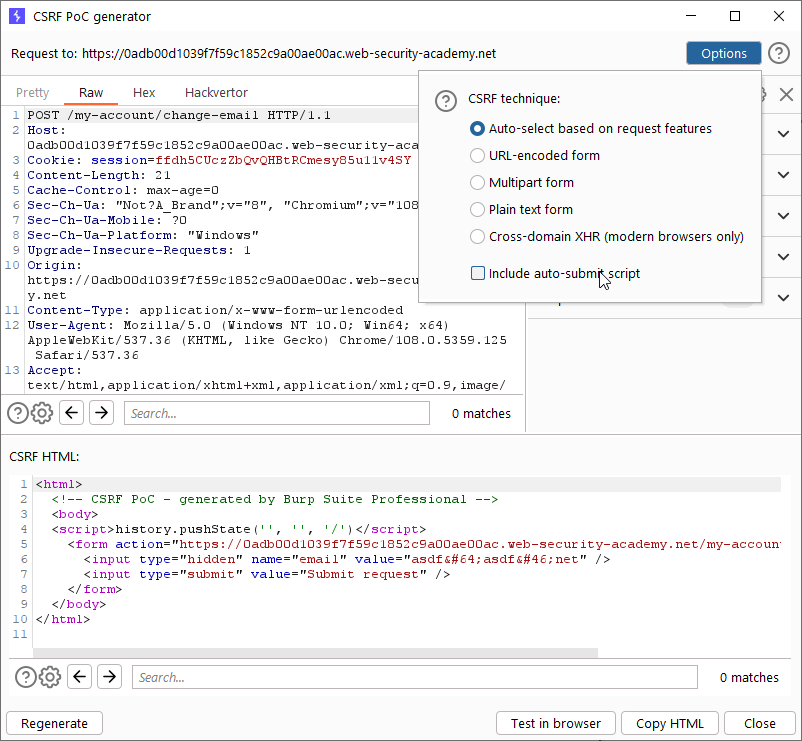

# Cross-site request forgery (CSRF)

## Theory

For a sucessful CSRF attack there are several conditions that need to be in place:

* **A relevant action**: Some privileged action such as modifying permissions for other user or change the user password or email
* **Cookie-based session handling**: There application must only rely on session cookies to identify the user.
* **Samesite**:
  * *Strict*: The browser will not include the cookie in any requests that originate from another site. It can impair the user experience, because if a logged-in user follows a third-party link to a site, then they will appear not to be logged in
  * *Lax*: The browser will include the cookie in requests that originate from another site but only if two conditions are met:
    * The request uses the GET method
    * The request resulted from a top-level navigation by the user, such as clicking a link
    A lax implementation may be vulnerable if the framework allows sending post requests via get or there are any sensible request that uses get
  * *None*: The browser always sends cookie
* **No unpredictable request parameters**: The requests that perform the action do not contain any parameters whose values the attacker cannot determine or guess
* **Content-Type**: Must be plain or something that can be sent using a post method. It is also possible to set a valid content-type but send a json file



### Impact

In a successful CSRF attack, the attacker causes the victim user to carry out an action unintentionally. For example, this might be to change the email address on their account, to change their password, or to make a funds transfer. Depending on the nature of the action, the attacker might be able to gain full control over the user's account

### Basic howto

Burp suite has options to generate a CSRF PoC:



Also there are options to include auto submit script or other encoding formats



### Delivering the exploit

There are several mechanisms to forge and deliver a CSRF exploit, however they all have in common that  

If the request can be performed using GET and the SameSite policy is None the payload can be self-contained:

```html

```

Usually that is not the case and it requires a HTML body 

```html
<html>
  <!-- CSRF PoC - generated by Burp Suite Professional -->
  <body>
  <script>history.pushState('', '', '/')</script>
    <form action="https://0adb00d1039f7f59c1852c9a00ae00ac.web-security-academy.net/my-account/change-email" method="POST">
      <input type="hidden" name="email" value="asdf&#64;asdf&#46;net" />
      <input type="submit" value="Submit request" />
    </form>
  </body>
</html>
```

Sometimes the Referer header of the request is validated and it is required to contain a specific value. For example another allowed domain.

To solve this issue we can use the function history.pushState that can include a query string 

```html
  [...]
  <script>history.pushState('', '', '/?YOUR-LAB-ID.web-security-academy.net')</script>
  [...]
```

However there is a final caveat; if you host this payload you may find that the browser does not send the query in the referrer. This is because many browsers now strip the query string from the Referer header by default as a security measure, to override this the following header must be added in the responses:

```
Referrer-Policy: unsafe-url
```

## Checklist

* [ ] Basic CSRF
* [ ] Switch method to GET
* [ ] Verify that content-type is not checked
---
* [ ] Check what happens with an invalid CSRF token
* [ ] Check what happens if there is no csrf token
* [ ] Check if CSRF token is tied to the session
* [ ] Check if CSRF token is tied to a non-session cookie and that cookie may be attacker controlled
    ```html
    
    ```
* [ ] Check if CSRF token is duplicated but not checked. This is simple to implement because there is no need to store its state at the server side 
---
* [ ] Check if Referer is being validated
* [ ] Check what happens if Referer is omited:
    ```html
    <meta name="referrer" content="no-referrer">
    ```
* [ ] Check if Referer validation can be circumvented (for example using the history.pushState() trick)